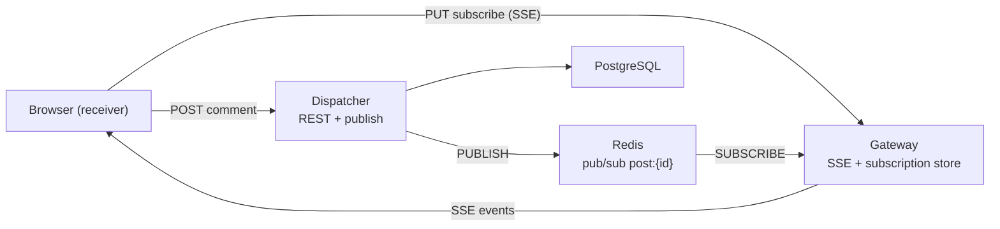

<!-- Generated by SpecStory, Markdown v2.1.0 -->

# 2026-05-19 14:31:14Z

<!-- Cursor IDE Session 21a6f636-6464-4d5e-b3c3-2fa5c429b3d6 (2026-05-19 14:31:14Z) -->

_**User**_

i am trying to have a presentation with this project, i am at the slide where i have to explain briefly the tech stack, the terminolofy of this project. you can abide by the article https://systemdesign.one/live-comment-system-design/  and give me a suggestion

---

_**Agent (composer-2.5)**_

I'll review your design doc and codebase so the tech stack and terminology slide matches what you've actually built.


_**Agent (composer-2.5)**_

File not found

<tool-use data-tool-type="read" data-tool-name="read_file_v2"><details>
<summary>Tool use: **read_file_v2**</summary>

</details></tool-use>

_**Agent (composer-2.5)**_

<tool-use data-tool-type="search" data-tool-name="glob_file_search">
<details>
<summary>Tool use: **glob_file_search** • Searched codebase "" • **45** results in **1** directory</summary>

Directory: **/home/duy-hieu/chat** (45 files)

| File |
|------|
| `RWMutex_cheat_sheet.txt` |
| `internal/httputil/httputil.go` |
| `internal/models/refresh_token.go` |
| `.env.example` |
| `internal/logger/logger.go` |
| `internal/pubsub/redis_test.go` |
| `cursor_prompt (1).md` |
| `internal/auth/refresh.go` |
| `internal/repository/users.go` |
| `internal/middleware/middleware.go` |
| `internal/repository/refresh_tokens.go` |
| `internal/handlers/sse.go` |
| `go.sum` |
| `internal/auth/jwt.go` |
| `internal/sse/writer.go` |
| `docker-compose.yml` |
| `internal/pubsub/pubsub.go` |
| `cmd/dispatcher/main.go` |
| `.specstory/.project.json` |
| `internal/subscription/inmemorystore_test.go` |
| `migrations/000001_init_auth.up.sql` |
| `internal/services/auth.go` |
| `cmd/gateway/main.go` |
| `internal/subscription/inmemorystore.go` |
| `migrations/000001_init_auth.down.sql` |
| `internal/handlers/auth.go` |
| `internal/auth/password.go` |
| `internal/db/db.go` |
| `cmd/dispatcher/dispatcher` |
| `internal/pubsub/redis.go` |
| `.specstory/history/2026-04-21_04-23-22Z-review-of-cursor-prompt-documentation.md` |
| `internal/pubsub/factory.go` |
| `internal/pubsub/streams.go` |
| `go.mod` |
| `internal/models/user.go` |
| `internal/channels/channels.go` |
| `internal/config/config.go` |
| `.cursorindexingignore` |
| `.specstory/history/2026-05-18_02-51-46Z-jsonl-file-review.md` |
| `Makefile` |
| `.specstory/cli/config.toml` |
| `internal/redisclient/redisclient.go` |
| `.gitignore` |
| `.specstory/statistics.json` |
| `internal/feed/hub.go` |

</details>
</tool-use>

<tool-use data-tool-type="search" data-tool-name="glob_file_search"><details>
<summary>Tool use: **glob_file_search**</summary>

</details></tool-use>

_**Agent (composer-2.5)**_

<tool-use data-tool-type="read" data-tool-name="read_file_v2">
<details><summary>Tool use: **read_file_v2** • Read file: /home/duy-hieu/chat/go.mod</summary>

</details>
</tool-use>

<tool-use data-tool-type="read" data-tool-name="read_file_v2"><details>
<summary>Tool use: **read_file_v2**</summary>

</details></tool-use>

_**Agent (composer-2.5)**_

<tool-use data-tool-type="unknown" data-tool-name="web_fetch">
<details>
<summary>Tool use: **web_fetch**</summary>


Parameters:

```json
{
  "url": "https://systemdesign.one/live-comment-system-design/"
}
```
Additional data:

```json
{
  "reviewData": {
    "isShowingInput": false,
    "selectedOption": "run",
    "status": "Done"
  }
}
```
Result:

```json
{
  "markdown": "Live Comment System Design - System Design\n\n# Live Comment System Design\n\n## Real-Time Live Commenting Platform\n\n---\n\nThe target audience for this article falls into the following roles:\n\n- References\n- Tech workers\n- Students\n- Engineering managers\n\nThe prerequisite to reading this article is fundamental knowledge of system design components. This article does not cover an in-depth guide on individual system design components.\n\nDisclaimer: The system design questions are subjective. This article is written based on the research I have done on the topic and might differ from real-world implementations. Feel free to share your feedback and ask questions in the comments.\n\n---\n\n---\n\nDownload my system design playbook for free on newsletter signup:\n\n---\n\n## How Does the Live Comment Work?\n\nAt a high level, the Live Comment service performs the following operations:\n\n- gateway server fans out live comments to the clients through [server-sent events](https://developer.mozilla.org/en-US/docs/Web/API/Server-sent_events/Using_server-sent_events)(SSE)\n- the client subscribes to a live video on the gateway server over Hypertext Transfer Protocol (HTTP)\n- in-memory subscription store on the gateway server keeps the viewership associativity\n- gateway server subscribes to a live video on the endpoint store\n- endpoint store keeps the set of gateway servers subscribed to a particular live video\n- heartbeat signal or time to live (TTL) on keys on the subscription store can be used to drain the inactive SSE connections\n- ending of a live video can trigger an update on the endpoint store\n- dispatcher broadcasts the live comments to the dispatcher in peer data centers\n\n---\n\n---\n\n---\n\n## What is a Live Video?\n\nLive video is the streaming of video over the internet in real-time without prior recording and storage. Television broadcasts, video game streams, and social media videos are often live-streamed 1.\n\n[Figure 1: Facebook Likes; Typing indicators; Live comments\"\u003e](https://systemdesign.one/live-comment-system-design/likes-typing-indicator-live-comment.webp) Figure 1: Facebook Likes; Typing indicators; Live comments\n\nLive video is different from regular videos because live video results in spiky traffic patterns. Usually, Live videos are more engaging and tend to be watched thrice more than regular videos. On top of that, social networks such as Facebook show live videos at the top of the newsfeed, thereby increasing the probability of live videos being watched by the users (clients) 2.\n\n---\n\n---\n\n---\n\n## What are Live Comments?\n\nLive comments; Source: video by [Joseph Redfield Nino](https://pixabay.com/users/josephredfield-8385382/) from [Pixabay](https://pixabay.com/videos/livestreaming-instagram-facebook-26774/)\n\nReal-time experience makes the platform feel like a place of activity for the clients 3. Live commenting is a feature that allows clients to publish real-time comments on live videos. The live comments are usually a mixture of feedback from the clients on the live video or casual conversations between clients. Besides, live comments enable the streamer of the live video to engage with the clients during the live video broadcast.\n\n---\n\n---\n\n---\n\n## Terminology\n\nThe following terminology might be helpful for you:\n\n- Node: a server that provides functionality to other services\n- Data replication: a technique of storing multiple copies of the same data on different nodes to improve the availability and durability of the system\n- Data partitioning: a technique of distributing data across multiple nodes to improve the performance and [scalability](https://newsletter.systemdesign.one/p/micro-frontends) of the system\n- API: a software intermediary that allows two services to talk with each other\n- Fault tolerance: the ability of a service to recover from a failure without losing data\n- High availability: the ability of a service to remain reachable and not lose data even when a failure occurs\n\n---\n\n---\n\n---\n\n## Questions to ask the Interviewer\n\n### Candidate\n\n1. What are the primary use cases of the system?\n2. Do live commenting service support only text?\n3. Are the clients distributed across the globe?\n4. What is the amount of Daily Active Users (DAU)?\n5. What is the system’s total number of daily live videos?\n6. What is the average amount of live comments on a live video?\n7. What is the anticipated read: write ratio of live comments?\n8. What is the peak amount of concurrent users watching the same live video?\n9. Should the comments on streamed videos be archived to save storage?\n\n---\n\n### Interviewer\n\n1. Clients can interact with each other in real-time over live comments on a Facebook live video\n2. Yes\n3. Yes\n4. 100 million DAU\n5. 200 million daily live videos\n6. 10\n7. 100: 1\n8. 80 million\n9. Yes, there is no need to support the replay of live comments\n\n---\n\n---\n\n---\n\n## Requirements\n\n### Functional Requirements\n\n- The publishers (client) can write real-time live comments on a Facebook live video\n- The receivers (clients) watching the Facebook live video should be able to view the live comments in real time\n- The receiver should be able to view an active real-time feed of live comments on each live video while scrolling across the Facebook newsfeed\n- The typing indicators (somebody is typing feature) should be supported\n- The total count of comments should be visible on each live video\n- The live comment service should handle clients across the globe\n- The live comment service should handle millions of concurrent clients\n\n---\n\n### Non-Functional Requirements\n\n- Highly availability\n- Fault-tolerant\n- Low latency\n- Scalability\n- Eventual [consistency](https://systemdesign.one/consistency-patterns/)\n\n---\n\n---\n\n---\n\n## Live Commenting API Design\n\nThe real-time Application Programming Interface (API) can be implemented for faster user experiences and instant delivery of live comments. The average time for a human to blink is 100 ms, and the average reaction time for a human is around 250 ms. Therefore, the actions performed within 250 ms are perceived as real-time or live 4, 5. An event-driven architecture can be used to build a real-time data platform. The general subscription models for an API are the following 6:\n\n- push-based (server-initiated)\n- pull-based (client-initiated)\n\nThe popular protocols for an event-driven API are the following 6:\n\n| Protocol | Description | Use Cases | Subscription Model |\n| --- | --- | --- | --- |\n| Webhook | HTTP-based callback function that allows lightweight, event-driven infrequent communication between APIs | trigger automation workflows | push-based |\n| WebSub | communication channel for frequent messages between web content publishers and subscribers based on HTTP webhooks | news aggregator platforms, stock exchanges, and air traffic networks | push-based |\n| WebSockets | provides full-duplex communication channels over a single TCP connection with lower overhead than half-duplex alternatives such as HTTP polling | financial tickers, location-based apps, and chat solutions | pull-based |\n| SSE | lightweight and subscribe-only protocol for event-driven data streams | live score updates | pull-based |\n| MQTT | protocol for streaming data between devices with limited CPU power and low bandwidth networks | Internet of Things | pull-based |\n\nThe communication protocol and subscription model chosen should be ideal to build a reliable and scalable live comment service. The pull-based subscription model is the optimal choice for the delivery of live comments to the receivers for the following reasons 6:\n\n- the receiver only needs to view the live comments when the receiver is online (connected or subscribed to the live video)\n- the receiver can ignore the comments when disconnected or unsubscribed\n- non-trivial to predict the total count of clients that will be subscribed to watching a live video\n- the receivers will be geographically distributed across the globe\n- the connection from the receiver might be unpredictable\n\n[Figure 2: REST compared with SSE\"\u003e](https://systemdesign.one/live-comment-system-design/rest-compared-with-sse.webp) Figure 2: REST compared with SSE\n\nThe client creates a regular HTTP long poll connection with the server with [server-sent events](https://developer.mozilla.org/en-US/docs/Web/API/Server-sent_events/Using_server-sent_events)(SSE). The server can push a continuous stream of data to the client on the same connection as events occur. The client doesn’t need to perform subsequent requests 7.\n\n[Figure 3: HTTP long poll with SSE\"\u003e](https://systemdesign.one/live-comment-system-design/http-long-poll-with-sse.webp) Figure 3: HTTP long poll with SSE\n\nThe only difference for SSE from a regular HTTP request is that the Accept header on the HTTP request holds the value text/event-stream. The [EventSource interface](https://developer.mozilla.org/en-US/docs/Web/API/EventSource) is used by the client to receive and process server-sent events independently in text/event-stream format without closing the connection. All modern web browsers support the EventSource interface natively. The EventSource interface can be implemented on [iOS](https://github.com/inaka/EventSource) and [Android](https://github.com/tylerjroach/eventsource-android) platforms with lightweight libraries 7, 8.\n\n[Figure 4: Complexity inversion in an event-driven API\"\u003e](https://systemdesign.one/live-comment-system-design/complexity-inversion-event-driven-api.webp) Figure 4: Complexity inversion in an event-driven API\n\nThe client is responsible for maintaining the state and execution of requests in the Representational state transfer (REST) paradigm. On the contrary, the server is responsible for maintaining the state and pushing updates to the client in an event-driven architecture. In layman’s terms, the complexity of the receiver is kept minimum in an event-driven API as the receiver only has to create an SSE connection to view the live comments on a Facebook live video 6. In conclusion, SSE is the optimal protocol for the live comment service due to the following reasons 7, 8:\n\n- SSE works over traditional HTTP\n- SSE streams chunks of data over the same open HTTP connection\n\nThe predefined fields of an SSE connection are the following 6:\n\n| Field | Description |\n| --- | --- |\n| event | the event type defined by the server |\n| data | the payload of the event |\n| id | ID for each event |\n| retry | the client attempts to reconnect with the server after a specific timeframe if the connection was closed |\n\nThe following are the drawbacks of SSE 6:\n\n- the data format is restricted to transporting UTF-8 messages with no support for binary data\n- only up to six concurrent SSE connections can be opened per web browser on pre-HTTP/2 networks\n\nThe components in the system expose the Application Programming Interface (API) endpoints to the client through Representational State Transfer (REST). The description of HTTP Request headers is the following:\n\n| Header | Description |\n| --- | --- |\n| accept | type of content the client can understand |\n| authorization | authorize your user account |\n| content-encoding | compression type used by the data payload |\n| method | HTTP Verb |\n| content-type | type of data format (JSON or XML) |\n\nThe description of HTTP Response headers is the following:\n\n| Header | Description |\n| --- | --- |\n| status code | shows if the request was successful |\n| content-type | type of data format |\n\n---\n\n---\n\n### How does the receiver subscribe to a specific live video?\n\nThe client must subscribe to a live video for viewing the live comments. The client executes an HTTP PUT request for subscribing to a live video. The PUT requests are idempotent. The PUT method is used instead of the GET method because the in-memory subscription store will be modified when a client subscribes to a live video.\n\n&#96;&#96;&#96;\n 1\n 2\n 3\n 4\n 5\n 6\n 7\n 8\n 9\n10\n11\n\n&#96;&#96;&#96;\n\n&#96;&#96;&#96;\n/videos/:video-id/subscriptions\nmethod: PUT\naccept: text/event-stream\nauthorization: Bearer \u003cJWT\u003e\ncontent-length: 20\ncontent-type: application/json\ncontent-encoding: gzip\n\n{\n  user_id: \u003cint\u003e\n}\n\n&#96;&#96;&#96;\n\nThe accept: text/event-stream HTTP request header indicates that the client is waiting for an open connection to the event stream from the server to fetch live comments 9. The server responds with status code 200 OK on success.\n\n&#96;&#96;&#96;\n1\n2\n\n&#96;&#96;&#96;\n\n&#96;&#96;&#96;\nstatus code: 200 OK\ncontent-type: text/event-stream\n\n&#96;&#96;&#96;\n\nThe content-type: text/event-stream HTTP response header indicates that the server established an open connection to the event stream to dispatch events to the client. The response event stream contains the live comments.\n\n&#96;&#96;&#96;\n1\n2\n3\n4\n\n&#96;&#96;&#96;\n\n&#96;&#96;&#96;\nid: 1\nevent: comment\ndata: {\"awesome\"}\ndata: {\"hey there\"}\n\n&#96;&#96;&#96;\n\n---\n\n---\n\n### How does the receiver unsubscribe from a live video?\n\nThe client should unsubscribe from a live video to stop receiving live comments. The client executes an HTTP DELETE request for unsubscribing from a live video 9. The DELETE requests are idempotent.\n\n&#96;&#96;&#96;\n1\n2\n3\n\n&#96;&#96;&#96;\n\n&#96;&#96;&#96;\n/videos/:video-id/subscriptions/:subscription-id\nmethod: DELETE\nauthorization: Bearer \u003cJWT\u003e\n\n&#96;&#96;&#96;\n\nThe server responds with status code 200 OK on success.\n\n&#96;&#96;&#96;\n1\n\n&#96;&#96;&#96;\n\n&#96;&#96;&#96;\nstatus code: 200 OK\n\n&#96;&#96;&#96;\n\nThe server responds with status code 204 No Content when the client successfully unsubscribes from a live video. The HTTP response body will be empty.\n\n&#96;&#96;&#96;\n1\n\n&#96;&#96;&#96;\n\n&#96;&#96;&#96;\nstatus code: 204 No Content\n\n&#96;&#96;&#96;\n\n---\n\n---\n\n### How does the client publish a live comment?\n\nThe client executes an HTTP POST request to publish a live comment.\n\n&#96;&#96;&#96;\n 1\n 2\n 3\n 4\n 5\n 6\n 7\n 8\n 9\n10\n11\n12\n\n&#96;&#96;&#96;\n\n&#96;&#96;&#96;\n/videos/:video-id/comments\nmethod: POST\naccept: application/json\nauthorization: Bearer \u003cJWT\u003e\ncontent-length: 2000\ncontent-type: application/json\ncontent-encoding: gzip\n\n{\n  user_id: \u003cint\u003e,\n  comment: \u003cobject\u003e\n}\n\n&#96;&#96;&#96;\n\nThe server responds with status code 200 OK on success.\n\n&#96;&#96;&#96;\n1\n\n&#96;&#96;&#96;\n\n&#96;&#96;&#96;\nstatus code: 200 OK\n\n&#96;&#96;&#96;\n\nAlternatively, the server responds with status code 201 created on success.\n\n&#96;&#96;&#96;\n1\n\n&#96;&#96;&#96;\n\n&#96;&#96;&#96;\nstatus code: 201 created\n\n&#96;&#96;&#96;\n\nThe server responds with status code 400 bad request for indicating a failed request due to an invalid request payload from the client.\n\n&#96;&#96;&#96;\n1\n\n&#96;&#96;&#96;\n\n&#96;&#96;&#96;\nstatus code: 400 bad request\n\n&#96;&#96;&#96;\n\nThe client receives a status code 403 forbidden when the client has valid credentials but insufficient privileges to act on the resource.\n\n&#96;&#96;&#96;\n1\n\n&#96;&#96;&#96;\n\n&#96;&#96;&#96;\nstatus code: 403 forbidden\n\n&#96;&#96;&#96;\n\n---\n\n---\n\n---\n\n## Further System Design Learning Resources\n\nDownload my system design playbook for free on newsletter signup:\n\n---\n\n---\n\n---\n\n## Live Comment System Database Design\n\nThe live comment service is a read-heavy system. In simple words, the predominant usage pattern is the client viewing live comments.\n\n### Database Schema Design\n\n[Figure 5: Live comment database schema\"\u003e](https://systemdesign.one/live-comment-system-design/live-comment-database-schema.webp) Figure 5: Live comment database schema\n\nThe major entities of the relational database are the comments table, the videos table, and the users table. The relationship between the users and the comments tables is 1-to-many. The relationship between the videos and the comments tables is 1-to-many. The relationship between the users and videos tables is 1-to-many.\n\n#### Comments table\n\n| Column | Description |\n| --- | --- |\n| id | ID to identify the comment |\n| user_id (Foreign key) | publisher of the comment |\n| video_id (Foreign key) | ID of the associated video |\n| content | content of the comment |\n| created_at | timestamp of creation |\n\n#### Videos table\n\n| Column | Description |\n| --- | --- |\n| id | identifier of the video |\n| title | title of the video |\n| user_id (Foreign key) | streamer of the live video |\n| created_at | timestamp of creation |\n\n#### Users table\n\n| Column | Description |\n| --- | --- |\n| id | identifier of the user |\n| name | name of the user |\n| email | email of the user |\n| profile_image | URL to fetch the profile image of user |\n| last_login | last login timestamp of the user |\n| created_at | timestamp of user account creation |\n\n---\n\n---\n\n### SQL\n\nStructured Query Language (SQL) is a domain-specific language for managing data stored in the relational database management system.\n\n#### Write a SQL query to fetch the latest ten comments on the live video with “35” as the video ID\n\n&#96;&#96;&#96;\n1\n2\n3\n4\n5\n\n&#96;&#96;&#96;\n\n&#96;&#96;&#96;\nSELECT *\nFROM comments\nWHERE video_id=\"35\"\nORDER BY created_at DESC\nLIMIT 10;\n&#96;&#96;&#96;\n\n#### Write a SQL query to insert a new live comment\n\n&#96;&#96;&#96;\n1\n2\n\n&#96;&#96;&#96;\n\n&#96;&#96;&#96;\nINSERT INTO comments (id, user_id, video_id, content, created_at)\nVALUES (3, \"42\", \"35\", \"awesome\", \"2050-08-22\");\n&#96;&#96;&#96;\n\n#### Write a SQL query to fetch the total count of comments on each video\n\n&#96;&#96;&#96;\n1\n2\n3\n\n&#96;&#96;&#96;\n\n&#96;&#96;&#96;\nSELECT COUNT(id), video_id\nFROM comments\nGROUP BY video_id;\n&#96;&#96;&#96;\n\n---\n\n---\n\n### Type of Data Store\n\nThe content of live comments contains only textual data and does not include any media files. A very fast and reliable database that not only persistently store data but also access the data quickly is a key feature for building the live comment service. The persistent storage of live comments is needed to retrieve the comments at a later point in time. In addition, the data kept in persistent storage can be used for auditing purposes 10. The relational database offers well-defined structures for comments, users, and videos. The relational database will be an optimal choice when the dataset is small. However, the relational database will be a suboptimal solution for live comment service due to the following scalability limitations 5:\n\n- the internal data structure adds delay to the data operations\n- complex queries are needed to reintegrate data because of data segregation\n\nThe creation of database indexes on video_id and created_at columns will improve the performance of the read operations at the expense of slow write operations. The NoSQL database such as [Apache Cassandra](https://cassandra.apache.org/_/index.html) can be used as persistent data storage for live comments due to the following reasons 5:\n\n- Log-structured merge-tree (LSM) based storage engine offers extremely high performance on writes\n- schemaless data model reduces the overhead of joining different tables\n- optimized natively for time series data\n\nApache Cassandra is not optimized for read operations due to the nature of the LSM-based storage engine. An in-memory database such as Redis can be used in combination with Apache Cassandra to improve the read performance and make the data storage layer scalable and performant for live comments. The geo-replication enabled Redis [cache](https://newsletter.systemdesign.one/p/caching-patterns) with a time to live (TTL) of 1 second can be added as a cache layer on top of Apache Cassandra to improve the read performance. In addition, live comments published on an extremely popular live video can be kept in the cache on network edges to improve the latency 10.\n\nThe sets data type in Redis can be used to efficiently store the live comments. The native deduplication logic of sets data type ensures that live comments are stored in memory without having an additional logic to prevent repeated live comments. The [sorted set](https://redis.io/docs/data-types/sorted-sets/) data type in Redis can be used for data integrity by maintaining the reverse chronological ordering of live comments. The sorted set data type can make use of the timestamp on live comments for sorting the live comments without implementing a custom sorting algorithm. The metadata of the publisher of a live comment can be stored in Redis hash data type for quick retrieval 4, 11, 5.\n\n[Figure 6: Live comments; AP in CAP Theorem\"\u003e](https://systemdesign.one/live-comment-system-design/live-comment-cap-theorem.webp) Figure 6: Live comments; AP in CAP Theorem\n\nThe receivers who are geographically located closer to the publisher of the live comment will see the live comment instantly while the receivers who are located on a different continent might see the live comment with a slight delay (lower than 250 ms) to favor availability and partition tolerance in the CAP theorem 10.\n\n---\n\n---\n\n---\n\n## Capacity Planning\n\nThe rate of clients viewing the live comments is significantly higher than the rate of clients publishing the live comments. The calculated numbers are approximations. A few helpful tips on [capacity planning](https://systemdesign.one/back-of-the-envelope) during system design are the following:\n\n- 1 million requests/day = 12 requests/second\n- round off the numbers for quicker calculations\n- write down the units while doing conversions\n\n### Traffic\n\nThe live comment service is a read-heavy system. The Daily Active Users (DAU) count is 100 million. On average, the total number of daily live videos is 200 million. A live video receives 10 comments on average.\n\n| Description | Value |\n| --- | --- |\n| DAU (write) | 2 billion |\n| QPS (write) | 12 thousand |\n| read: write | 100: 1 |\n| QPS (read) | 1.2 million |\n\n---\n\n---\n\n### Storage\n\nThe comments on a streamed live video can be archived and kept in a cold store to save storage costs. In addition, comments older than a specific time frame can be removed to minimize storage costs. The storage size of each character on a live comment is assumed to be 1 byte.\n\n| Description | Size (bytes) |\n| --- | --- |\n| id | 20 |\n| user_id | 20 |\n| video_id | 20 |\n| content | 2000 |\n| created_at | 10 |\n\n| Description | Calculation | Total |\n| --- | --- | --- |\n| storage for a day | 12k comments/sec * 2 KB/comment * 86400 sec/day | 2 TB |\n\nIn total, a live comment is approximately 2 KB in size. The replication factor for storage can be set to three for improved durability and disaster recovery.\n\n---\n\n---\n\n### Bandwidth\n\nIngress is the network traffic that enters the server when live comments are written. Egress is the network traffic that exits the servers when live comments are viewed. The network bandwidth is spread out across the globe depending on the location of the clients.\n\n| Description | Calculation | Total |\n| --- | --- | --- |\n| Ingress | 2 billion comments/day * 2 KB/comment * 10^(-5) day/sec | 40 MB/sec |\n| Egress | 200 billion comments/day * 2 KB/comment * 10^(-5) day/sec | 4 GB/sec |\n\n---\n\n---\n\n### Memory\n\nThe in-memory subscription store keeps the client viewership associations.\n\n| Description | Calculation | Total |\n| --- | --- | --- |\n| Subscription store | 100 million users/day * 16 bytes/user | 1.6 GB/day |\n\n---\n\n---\n\n---\n\n## Further System Design Learning Resources\n\nDownload my system design playbook for free on newsletter signup:\n\n---\n\n---\n\n---\n\n## Live Commenting High-Level Design\n\n### Write Globally and Read Locally\n\n[Figure 7: Write globally and read locally through asynchronous database replication\"\u003e](https://systemdesign.one/live-comment-system-design/write-globally-read-locally.webp) Figure 7: Write globally and read locally through asynchronous database replication\n\nThe database can be configured to asynchronously replicate the data across the database servers in data centers located on distinct continents. In layman’s terms, the data is always fetched by the server from the database servers in the local data center while the data updates are asynchronously written to database servers in data centers across the globe. This technique is known as writing globally and reading locally. For instance, when a client located in the US publishes a live comment on a Facebook live video, the clients located in Europe will not see the live comment instantaneously due to the asynchronous nature of data replication. The following are the drawbacks of writing globally and reading locally approach for implementing live comment service 12:\n\n- significant bandwidth usage on data replication\n- live comments will not be real-time due to asynchronous replication\n- poor overall latency\n\nIn summary, do not use the writing globally and reading locally approach for implementing live comments.\n\n---\n\n---\n\n### Write Locally and Read Globally\n\n[Figure 8: Write locally and read globally through timestamp query (pull-based model)\"\u003e](https://systemdesign.one/live-comment-system-design/write-locally-read-globally-pull-based.webp) Figure 8: Write locally and read globally through timestamp query (pull-based model)\n\nThe data is always written to the database server in the local data center while the data is fetched by querying the servers in data centers across the globe as shown in Figure 8. This technique is known as the pull-based model of writing locally and reading globally. The timestamp on the live comments can be used to check if there are newer comments published since the last query execution. The server in the local data center will consolidate all the published live comments and return the response to the client. The bandwidth usage is relatively lower because the data is not replicated globally. However, the pull-based model will result in degraded latency because the server must query all the data centers across the globe on each read operation 12. In summary, do not use the pull-based model of writing locally and reading globally approach for implementing live comments.\n\n[Figure 9: Write locally and read globally through broadcasting (push-based model)\"\u003e](https://systemdesign.one/live-comment-system-design/write-locally-read-globally-push-based.webp) Figure 9: Write locally and read globally through broadcasting (push-based model)\n\nThe data is always written to the distributed database server in the local data center. In Figure 9, when a client publishes a live comment on a Facebook live video, the write operation is broadcast by the server to multiple data centers across the globe. This technique is known as the push-based model of writing locally and reading globally. The push-based model of writing locally and reading globally significantly reduces the usage of expensive bandwidth and improves the latency resulting in real-time live comments 12. In summary, use the push-based model of writing locally and reading globally for implementing live comments.\n\n---\n\n---\n\n### Prototyping a Live Comment Service\n\n[Figure 10: Prototyping a Live comment service\"\u003e](https://systemdesign.one/live-comment-system-design/prototyping-live-comment.webp) Figure 10: Prototyping a Live comment service\n\nThe clients watching a live video are known as receivers and the clients publishing live comments on a live video are known as publishers. The server holding the SSE connections to the receivers is known as the gateway server. A dedicated disk-based subscription store can be provisioned to persist the lifecycle of the client connections. The dispatcher is an abstraction layer for publishing data objects such as live comments or [Facebook likes](https://systemdesign.one/distributed-counter-system-design/) by the client. The following operations are performed when a live comment is published on a live video 13:\n\n1. receiver subscribes to a live video on the gateway server\n2. gateway server persists the metadata of the client connection in the subscription store\n3. the publisher publishes a live comment on a live video\n4. dispatcher queries the subscription store for all viewership associations on the live video\n5. dispatcher publishes the live comment to the gateway server\n6. gateway server delivers the live comment to all subscribed receivers\n\nThe gateway server maintains the SSE connections with the clients. The subscription store should be replicated at least thrice for reliability and durability 13. The subscription store will become a bottleneck to scaling the live comment service because every read and write operation on live comments must query the subscription store. On top of that, the client connections to a specific live video are short-lived because clients scroll through the Facebook newsfeed. As a result, the subscription store must be updated frequently. In summary, the current prototype will not meet the requirements of a scalable and reliable live comment service.\n\n---\n\n---\n\n### Distribution of Live Comments\n\n[Figure 11: Distribution of live comments through SSE\"\u003e](https://systemdesign.one/live-comment-system-design/distribution-live-comment.webp) Figure 11: Distribution of live comments through SSE\n\nThe receiver can periodically request (pull-based) the server to check whether new live comments were published. The periodic polling of the server will result in empty responses consuming unnecessary bandwidth. Moreover, the polling interval for live comments should be lower than 250 ms for a real-time experience. The increased polling frequency will highly likely overload the servers. The push-based approach using SSE persistent connections is optimal for the real-time delivery of live comments to the receivers 12.\n\n[Figure 12: In-memory subscription store on gateway server keeping viewership associations\"\u003e](https://systemdesign.one/live-comment-system-design/subscription-store-gateway.webp) Figure 12: In-memory subscription store on gateway server keeping viewership associations\n\nThe SSE connections to the client are non-blocking fire-and-forget for improved performance 7. An in-memory subscription store using Redis can be provisioned locally on the gateway server to store the one-to-one associations between the receivers and the Facebook live video. The [sets](https://redis.io/docs/data-types/sets/) data type in Redis can be used to efficiently store the ephemeral viewership associations. The subscription store is queried to identify the receivers who should receive the live comments on a specific live video 12.\n\n[Figure 13: Live comment delivery through the real-time platform\"\u003e](https://systemdesign.one/live-comment-system-design/live-comment-delivery-real-time-platform.webp) Figure 13: Live comment delivery through the real-time platform\n\nAn abstract and scalable real-time platform can be built for real-time experiences such as displaying [real-time presence](https://systemdesign.one/real-time-presence-platform-system-design/), push notifications, [Facebook likes](https://systemdesign.one/distributed-counter-system-design/), [Facebook reactions](https://systemdesign.one/distributed-counter-system-design/), typing indicators, and live comments. The real-time platform can be reused across multiple platforms such as Facebook, Messenger, Instagram, Twitch, TikTok, LinkedIn, or YouTube 13. A dynamically configurable plugin system architecture should be implemented to create an abstract real-time platform. Plugins are embedded executable code for additional logic that gets invoked on distinct events such as the publishing of a live comment 3. The principle behind building a scalable distributed system is to start small and iteratively add simple layers to the architecture 7. The general guidelines for horizontally scaling a service are the following 14:\n\n- keep the service stateless\n- partition the service\n- replicate the service\n\n---\n\n---\n\n### Live Commenting With Pub-Sub Server\n\n[Figure 14: Pub-sub server for live comments\"\u003e](https://systemdesign.one/live-comment-system-design/live-comment-pub-sub.webp) Figure 14: Pub-sub server for live comments\n\n[Publish-Subscribe](https://en.wikipedia.org/wiki/Publish%E2%80%93subscribe_pattern)(pub-sub) pattern allows services running on distinct technologies to communicate with each other 11. The pub-sub technique using the message bus enables a producer to send live comments (messages) to multiple consumers. The services can communicate with each other instantly without having preset intervals for polling data from relevant data sources in a reactive architecture 5.\n\n---\n\n#### Using Apache Kafka as the Pub-Sub Server\n\n[Figure 15: Live comments; Apache Kafka as the pub-sub server\"\u003e](https://systemdesign.one/live-comment-system-design/kafka-pub-sub.webp) Figure 15: Live comments; Apache Kafka as the pub-sub server\n\nApache Kafka is configured as the pub-sub server to decouple the producers and consumers. The live comment service can be reliably scaled through the separation of concerns. The streaming protocol of [Kafka](https://kafka.apache.org/protocol.html) offers lower overheads per message and provides ordering guarantees, integrity guarantees, and idempotency. Besides, the Kafka streaming protocol enables sharding the data before [streaming](https://newsletter.systemdesign.one/p/what-is-critical-rendering-path) the data to consumers 6, 7. The system design of live comments is challenging for the following reasons:\n\n- clients will continuously scroll through the Facebook [newsfeed](https://newsletter.systemdesign.one/p/feed-architecture)\n- live videos visible on the viewport of the client will change frequently\n\nThere will be multiple receivers (consumers) watching a live video. The live comments published on the live video should be consumed by all the receivers. When the client scrolls through the Facebook newsfeed or navigates outside the comments panel, the client is not supposed to see the live comments anymore. The consumer should dynamically unsubscribe from the specific live video (Kafka topic) to stop seeing the live comments on the specific live video. However, unsubscribing from a Kafka topic is an expensive operation 15, 16. In addition, tracking the gateway servers consuming specific live videos is non-trivial resulting in oversubscription to all Kafka topics. The limitations of using Apache Kafka for building the live comment service can be summarized as the following 7:\n\n- degraded latency because consumers use a pull-based model\n- limited scalability because each consumer should subscribe to all the Kafka topics and consume all the messages\n- operational complexity of Apache Kafka is relatively high\n\nThe Kafka topics can be partitioned by the stream IDs at the expense of unbalanced partitions. Consumers can subscribe to specific partitions using [consistent hashing](https://systemdesign.one/consistent-hashing-explained/) 3. Nonetheless, the consumers will not know in advance the stream IDs that the clients will be interested in. In a typical scenario, a server will have a diverse set of clients interested in almost all the live videos resulting in subscriptions to all the live videos. [Apache Pulsar](https://pulsar.apache.org/) also runs into a similar set of challenges as Apache Kafka for the use case of live comment service 7. In summary, do not use Apache Kafka as the pub-sub server for implementing live comments.\n\n---\n\n---\n\n#### Using Redis as the Pub-Sub Server\n\n[Figure 16: Live comments; Redis cluster as the pub-sub server\"\u003e](https://systemdesign.one/live-comment-system-design/redis-cluster-pub-sub.webp) Figure 16: Live comments; Redis cluster as the pub-sub server\n\nThe clients must use a protocol named REdis Serialization Protocol (RESP) for communicating with the Redis server. Redis can be used as the [pub-sub](https://redis.io/docs/manual/pubsub/) server to transmit live comments (messages) between nodes 4. The Redis cluster can be used to [scale](https://newsletter.systemdesign.one/p/scalable-software-architecture) the pub-sub server. The Redis pub-sub server replicates every incoming message to all nodes because Redis does not know the set of clients (receivers) on a specific node resulting in degraded performance. The [consistent hashing](https://systemdesign.one/consistent-hashing-explained/) algorithm is used for load-balancing client subscriptions to live videos between a set of independent Redis nodes for improved scalability. [Consistent hashing](https://systemdesign.one/consistent-hashing-explained/) significantly reduces the movement of live connections between nodes on a node failure or node addition. In layman’s terms, the incoming messages are published to all Redis nodes but the server only listens on a small set of nodes for a specific subscription (live video) for improved scalability. The Redis replicas should be provisioned on every node to perform automatic failover when a node failure occurs 3.\n\nA TCP connection is maintained between the producer to Redis and Redis to the consumer for delivering messages. As an unconventional workaround, the server could terminate the TCP connection between the consumer node and the pub-sub server for unsubscribing the consumer from a topic (live video) when the client scrolls through the Facebook newsfeed. The drawbacks of using the Redis pub-sub server for live comment service are the following:\n\n- no guaranteed at least one-time message delivery\n- reliability of message delivery depends on the TCP connection\n- messages might get lost due to a lack of message persistence\n\nIn conclusion, do not use the Redis pub-sub server solution for implementing live comments.\n\n---\n\n---\n\n#### Using Redis Streams as the Pub-Sub Server\n\n---\n\nThe Redis stream is a data structure that can be used like an append-only log for improving the responsiveness of the system. In simple words, Redis streams are functionally very equivalent to Apache Kafka. The Redis streams as the pub-sub server offer the following benefits 17, 18, 5, 19, 20, 21:\n\n- guaranteed at least one-time delivery of messages\n- reliable messages through persistence with Append Only File (AOF) or Redis Database (RDB) persistency methods\n- more tolerant to network partitions\n- improved latency due to efficient in-memory storage\n- relatively trivial to provision and operate\n- messages can be consumed either in blocking or non-blocking methods\n\nThe Redis Sentinel or Redis Active-Active configuration provides high availability for the cluster at the expense of increased operational complexity. The Redis Sentinel is a distributed system that monitors and provides failover policies to Redis instances. Redis streams could dynamically unsubscribe consumers from a specific topic (live video). However, there is a risk of data loss in Redis streams because the data is only periodically written to disk. The memory limitation could also be a bottleneck to building a scalable live commenting service 19, 21. In conclusion, do not use Redis streams as the pub-sub server solution for implementing live comments.\n\n---\n\n---\n\n### An Abstract Real-Time Platform\n\n[Figure 17: Live comment; High-level design\"\u003e](https://systemdesign.one/live-comment-system-design/live-comment-high-level-design.webp) Figure 17: Live comment; High-level design\n\nAn in-memory subscription store can be provisioned using Redis on the same machine where the gateway server runs. The in-memory subscription store will hold the mapping between live videos and receivers (client connections). The gateway server can perform throttling and include additional product logic. A dedicated disk-based endpoint store can be used to identify the gateway servers interested in a specific live video. The endpoint store will contain a mapping between the live videos and a set of gateway servers. The following operations are performed when a live comment is published on a live video 13:\n\n1. receiver subscribes to a live video on the gateway server\n2. the gateway server updates the subscription store with viewership association and informs the endpoint store that the gateway server is interested in the specific live video\n3. the publisher writes a live comment on the specific live video\n4. dispatcher queries one of the replicas of the endpoint store to fetch the set of subscribed gateway servers\n5. the dispatcher forwards the live comment to the subscribed gateway servers\n6. the gateway server checks the local in-memory subscription store and fans out the live comment to subscribed receivers\n\nThe following operations can be executed for removing the expired records from the in-memory subscription store on the gateway server:\n\n- the gateway server can send periodic heartbeat signals to the receivers to check if they are still connected\n- Redis TTL keys can expire the subscription record when the heartbeat signals show a failure\n- client-side JavaScript logic can trigger an event when the client scrolls away from the live video\n\nThe endpoint store should remove the live video only when the set of gateway servers subscribed to the live video is empty. Redis set data type allows checking the cardinality of the set in constant time complexity. The ending of a live video can trigger the expiry of the records in the disk-based endpoint store. In summary, the current architecture can satisfy the requirements of a scalable and reliable live comment service.\n\n---\n\n---\n\n---\n\n## Further System Design Learning Resources\n\nDownload my system design playbook for free on newsletter signup:\n\n---\n\n---\n\n---\n\n## Live Comment System Design Deep Dive\n\nLive experiences are underpinned by real-time, event-driven APIs for meeting the requirements of clients. A real-time platform is predicated upon low latency, data integrity, fault tolerance, availability, and scalability 4.\n\n### How Does the Gateway Server Manage Client Connections?\n\nAn [actor](https://en.wikipedia.org/wiki/Actor_model) is an extremely lightweight object that can receive messages and take actions to handle the messages. The actor is decoupled from the source of the message. The actor is only responsible for recognizing the type of message received and performing the required action. A thread will be assigned to an actor when a message must be processed. The thread is released once the message is processed and the thread is assigned to the next actor. The total count of threads will be proportional to the count of CPU cores. A relatively small count of threads can handle a significant number of concurrent actors because a thread is assigned to an actor only during the execution time 7, 8, 22.\n\n[Figure 18: Gateway server; Client connection management using the actor model\"\u003e](https://systemdesign.one/live-comment-system-design/actor-model-gateway-server.webp) Figure 18: Gateway server; Client connection management using the actor model\n\nAn SSE persistent client connection can be assigned to an actor. When an actor receives a message, the handler on the actor defines how the message will be published to the client connection. The actor-style programming can be implemented with actor frameworks such as [Akka](https://akka.io/)(Java, Scala), [Pykka](https://pykka.readthedocs.io/en/latest/index.html)(Python), or [Cloudi](https://cloudi.org/)(Erlang) for building highly concurrent, distributed, and resilient message-driven applications 7, 8, 22.\n\n[Figure 19: Gateway server; Broadcasting live comments using the actor model\"\u003e](https://systemdesign.one/live-comment-system-design/actor-model-broadcast.webp) Figure 19: Gateway server; Broadcasting live comments using the actor model\n\nThe (child) actors are managed by the supervisor actor. The following operations are executed when a live comment is published by the dispatcher 7:\n\n1. the dispatcher publishes a live comment to the supervisor actor in the gateway server over the HTTP\n2. the supervisor actor broadcasts the live comment to all the child actors\n3. child actors use the connection handle to forward the live comment to the receivers\n\nThe client (receiver) will render the received live comment on the web browser.\n\n---\n\n---\n\n### How to Handle Live Comments on Multiple Live Videos?\n\nThere might be multiple clients watching distinct live videos connected to the same gateway server. The actors on the gateway server should not publish the live comment on a specific live video to all the connected clients because some of the clients might be watching a different live video. In Figure 20, clients connected to the same gateway server are watching distinct live videos with live video IDs blue and red. When the client publishes a live comment on the live video with blue as the ID, only the clients watching the live video with blue as the ID should be able to view the published live comment.\n\n[Figure 20: Gateway server; Publishing live comments on multiple live videos using a subscription\"\u003e](https://systemdesign.one/live-comment-system-design/live-comment-multiple-videos.webp) Figure 20: Gateway server; Publishing live comments on multiple live videos using a subscription\n\nAn in-memory subscription store using Redis can be provisioned to run on the same machine where the gateway server runs. The client starting to watch a live video subscribes to the specific live video on the gateway server over HTTP. The subscription store will keep an in-memory mapping between a live video and the set of receivers. An in-memory subscription store is used by the gateway server for storing viewership associativity for the following reasons 7:\n\n- subscription data is local to clients connected to the gateway server\n- the client connections are strongly tied to the lifecycle of the gateway server\n\nIn layman’s terms, an in-memory subscription store is used to identify the live video watched by each client connected to the gateway server. The following operations are executed when a client publishes a live comment on the live video with blue as the ID 7:\n\n1. the dispatcher publishes a live comment to the supervisor actor in the gateway server over the HTTP\n2. the supervisor actor queries the local in-memory subscription store to identify the clients subscribed to the live video with blue as the ID\n3. the supervisor actor broadcasts the live comment to all the subscribed child actors\n4. child actors use the connection handle to forward the live comment to the receivers\n\nThe local in-memory subscription store allows the efficient publishing of live comments on multiple live videos.\n\n---\n\n---\n\n### How to Support Massive Concurrent Clients on Multiple Live Videos?\n\n[Figure 21: Dispatcher broadcasting live comments between gateway servers\"\u003e](https://systemdesign.one/live-comment-system-design/dispatcher-broadcast-live-comments.webp) Figure 21: Dispatcher broadcasting live comments between gateway servers\n\nThe gateway server should be partitioned by provisioning multiple instances of gateway servers to handle massive concurrent clients as shown in Figure 21. An additional service known as the dispatcher is provisioned to broadcast live comments between multiple gateway servers 7. The clients connected to a gateway server might be watching only a subset of live videos. It is inefficient for the dispatcher to broadcast the live comments on all live videos to all gateway servers because some gateway servers might be subscribed to only a subset of live videos.\n\n[Figure 22: Dispatcher broadcasting live comments to all gateway servers\"\u003e](https://systemdesign.one/live-comment-system-design/dispatcher-broadcast-all-gateway.webp) Figure 22: Dispatcher broadcasting live comments to all gateway servers\n\nFor example, in Figure 22, clients connected to gateway server 1 are only watching the live video with blue as the video ID. When the dispatcher publishes live comments on live video with red as the video ID to the gateway server 1, the published live comments will be processed and subsequently ignored by the gateway server 1 resulting in wasted computing resources. The dispatcher should not publish live comments on all live videos to all the gateway servers for improved performance 7.\n\n[Figure 23: Gateway servers subscribing to an in-memory endpoint store in the dispatcher\"\u003e](https://systemdesign.one/live-comment-system-design/gateway-server-subscribe-endpoint-store.webp) Figure 23: Gateway servers subscribing to an in-memory endpoint store in the dispatcher\n\nAn in-memory endpoint store using Redis can be provisioned to run locally on the same machine as the dispatcher. The client starting to watch a live video subscribes on the gateway server over HTTP. The subscription store in the gateway server will keep the mapping between the specific live video and the set of receivers. The gateway server will subscribe to the specific live video on the dispatcher over HTTP. An in-memory endpoint store on the dispatcher will keep the mapping between a live video and the set of subscribed gateway servers. An in-memory endpoint store is used by the dispatcher for keeping the subscription data of the gateway servers due to the following reasons 7:\n\n- efficiently dispatch live comments across multiple gateway servers\n- identify the gateway servers subscribed to a particular live video\n\nIn layman’s terms, an in-memory endpoint store in the dispatcher is used to identify the live video subscription by the gateway servers for improved performance.\n\n[Figure 24: Dispatcher publishing live comments to the subscribed gateways servers\"\u003e](https://systemdesign.one/live-comment-system-design/dispatcher-publish-subscribed-gateway-servers.webp) Figure 24: Dispatcher publishing live comments to the subscribed gateways servers\n\nThe following operations ate executed when the client publishes a live comment on the live video with red as the ID 7:\n\n1. the dispatcher queries the local in-memory endpoint store to identify the subscribed gateway servers on the live video with red as the ID\n2. the dispatcher publishes the live comment to the subscribed gateway servers over HTTP\n3. the gateway server queries the local in-memory subscription store to identify the clients subscribed to the live video with red as the ID\n4. the gateway server broadcasts the live comment to all the subscribed clients through SSE\n\nThe major drawback of the current architecture is that the dispatcher becomes the bottleneck for scalability. The performance of the live comment will degrade on peak load because there is only a single instance of dispatcher deployed.\n\n---\n\n---\n\n### Scaling Live Comments to Handle Peak Load\n\nWhen an extremely high rate of live comments is published per second, the single instance of dispatcher will degrade the overall performance of the live comment service. The dispatcher can be replicated for horizontal scaling. The dispatcher should be made stateless for replicating the dispatcher. The dispatcher can become stateless by moving out gateway subscription state to an external store.\n\nA disk-based key-value store known as the endpoint store can persist the subscription associations between a live video and the set of gateway servers. The endpoint store must be replicated for scalability and high availability. The endpoint store should only persist the gateway server subscription local to the data center. DynamoDB, Redis, or MongoDB can be used to provision the endpoint store. In addition, the endpoint store provides durability in case the dispatcher fails. Any dispatcher will be able to identify the set of subscribed gateway servers by querying the external endpoint store 7.\n\n[Figure 25: Scaling the dispatcher using a key-value endpoint store\"\u003e](https://systemdesign.one/live-comment-system-design/scaling-dispatcher.webp) Figure 25: Scaling the dispatcher using a key-value endpoint store\n\nThe dispatcher communicates with gateway servers over HTTP. Any dispatcher instance will be able to publish live comments to any gateway server. The following operations are executed when the client publishes a live comment on a live video with red as the ID 7:\n\n1. the dispatcher independently queries the external endpoint store to identify the set of subscribed gateway servers on the live video with red as the ID\n2. the dispatcher publishes the live comment to the set of subscribed gateway servers over HTTP\n3. the gateway server queries the local in-memory subscription store to identify the clients subscribed to the live video with red as the ID\n4. the gateway server broadcasts the live comment to all the subscribed clients through SSE\n\nThe endpoint store doesn’t need to be partitioned due to the small dataset.\n\n---\n\n---\n\n### What Is the Subscribe Workflow and Publish Workflow for Live Comments?\n\n[Figure 26: Live comment; Subscribe workflow when the client starts watching a live video\"\u003e](https://systemdesign.one/live-comment-system-design/subscribe-workflow.webp) Figure 26: Live comment; Subscribe workflow when the client starts watching a live video\n\nThe following operations are executed for the subscription when the client starts watching a live video 7:\n\n1. the client subscribes to the gateway server over HTTP\n2. the gateway stores the viewership associations on the in-memory subscription store\n3. the gateway server makes a subscription request on the endpoint store by creating an entry on the key-value store\n\n[Figure 27: Live comment; Publish workflow when the client publishes a live comment\"\u003e](https://systemdesign.one/live-comment-system-design/publish-workflow.webp) Figure 27: Live comment; Publish workflow when the client publishes a live comment\n\nThe following operations are executed when the client publishes a live comment on the live video 7:\n\n1. the load balancer distributes the live comment published by the client to any random dispatcher over HTTP\n2. the dispatcher queries the endpoint store for identifying the set of gateway servers subscribed to the particular live video\n3. the dispatcher forwards the live comment to the set of subscribed gateway servers over the HTTP\n4. the gateway servers query the local in-memory subscription store to identify the subscribed clients for the particular live video\n5. the gateway servers broadcast the live comments to the subscribed clients over SSE\n\n---\n\n---\n\n### How to Deploy the Live Comment Service Across Multiple Data Centers?\n\nThe live comment service should be deployed across multiple data centers (DC) for scalability and performance. There might be a scenario when no clients are watching a particular live video on some data centers. The dispatcher can query the local endpoint store to identify if there are any gateway servers subscribed to the particular live video in the local data center. The endpoint store keeps only gateway servers subscription local to the data center 7.\n\nFor instance, in Figure 28, no clients are watching the video with red as the video ID on data centers one and three. When a client publishes a live comment on the live video with red as the video ID, only the dispatcher on data center two should broadcast the live comment to the subscribed gateway servers. The dispatcher must broadcast the live comment to the dispatchers in peer data centers for ensuring that the clients subscribed to the particular live video on peer data centers receives the live comment in real-time.\n\n[Figure 28: Publishing the live comment across data centers through broadcasting\"\u003e](https://systemdesign.one/live-comment-system-design/live-comment-cross-data-center.webp) Figure 28: Publishing the live comment across data centers through broadcasting\n\nThe following operations are executed when the client publishes a live comment on the live video 7:\n\n1. [GeoDNS](https://en.wikipedia.org/wiki/GeoDNS) routes the live comment to a dispatcher on the data center closest to the client\n2. the dispatcher broadcasts the live comment to dispatchers on peer data centers over HTTP\n3. the dispatcher queries the local endpoint store to check if there are any subscribed gateway servers on the particular live video\n4. the subscribed gateway server queries the local in-memory subscription store to identify the subscribed clients\n5. the gateway server fans out the live comment to the subscribed clients over SSE\n\nThe current architecture is scalable and will satisfy the requirements of live comment system design. The alternative approaches for implementing cross-data center live comment service are the following:\n\n- cross-data center subscription\n- endpoint store configured for the entire region\n\nWhen the client starts watching a live video, the gateway server could perform a cross-data center subscription. However, the client connections are ephemeral because the client might scroll through the Facebook newsfeed, and the gateway servers subscription should be frequently updated across cross-data centers causing poor performance and degraded latency.\n\nAlternatively, the endpoint store can be configured globally for keeping gateway servers subscriptions across multiple data centers covering an entire region. When a key-value store such as DynamoDB is used for the endpoint store, the [quorum](https://en.wikipedia.org/wiki/Quorum_%28distributed_computing%29) should be tuned to higher [consistency](https://systemdesign.one/consistency-patterns/) to ensure that all subscribed gateway servers will receive live comments. However, the global endpoint store will result in some clients not receiving the live comments due to eventual consistency and also cause poor latency.\n\n---\n\n---\n\n### How to Support the Typing Indicators on Live Video?\n\nThe JavaScript logic using [event listeners](https://developer.mozilla.org/en-US/docs/Web/API/EventTarget/addEventListener) on the client can trigger events when the user starts typing a live comment. The real-time platform can broadcast the typing event to the subscribed clients. The web browser on the subscribed clients can display the typing indicator.\n\n---\n\n---\n\n### How to Display the Total Count of Comments on Each Live Video?\n\n[HyperLogLog](https://en.wikipedia.org/wiki/HyperLogLog) can be used to show the approximate count of total comments on each live video in a space-efficient manner. [Redis](https://redis.io/docs/data-types/hyperloglogs/) offers out-of-the-box support for HyperLogLog probabilistic data structure.\n\n---\n\n---\n\n---\n\nDownload my system design playbook for free on newsletter signup:\n\n---\n\n---\n\n---\n\n### Scalability\n\n[Figure 29: Performance of live comment distribution\"\u003e](https://systemdesign.one/live-comment-system-design/live-comment-performance.webp) Figure 29: Performance of live comment distribution\n\nThe dispatcher provisioned on a modern server can handle up to 5000 requests per second. A modern gateway server implemented with the actor model can hold up to 100 thousand concurrent SSE client connections. The multiplication factor introduced by the combination of the dispatcher and gateway servers makes the live commenting service extremely scalable. Another multiplication factor is within the gateway server using the [actor model](https://newsletter.systemdesign.one/p/actor-model). The actor model allows the reuse of a pool of threads for increased throughput. The live comment service can be horizontally scaled by provisioning new servers 7, 22, 2.\n\n[Figure 30: Load balancing client connection to the gateway servers\"\u003e](https://systemdesign.one/live-comment-system-design/load-balance-gateway-servers.webp) Figure 30: Load balancing client connection to the gateway servers\n\nLoad balancers should be introduced between different layers of the system for scalability and improved fault tolerance. The services should utilize the full capacity of the servers for scalability 23. Autoscaling can be enabled to meet elastic demand and deal with potential traffic spikes. Horizontal scaling comes with the tradeoff of a complex architecture, and increased infrastructure and maintenance costs 4.\n\n---\n\n---\n\n### Latency\n\nThe live comment service is deployed on multiple data centers to keep the clients closer to the servers to improve the latency. [Apache Samza](https://samza.apache.org/) can be used to measure the end-to-end latency of the live comment microservice system 24. The latency of the live comment service is quite low due to the following reasons 4, 7, 23:\n\n- there is only one key value lookup from the (disk-based) endpoint store\n- there is only one in-memory lookup from the subscription store\n- the network hops are very few\n\nAdditionally, Redis can be configured in the cache-aside pattern for improving the performance of endpoint store lookups because frequent disk I/O might become a bottleneck. The TTL on the Redis cache must be set to a reasonably short timeframe for cache invalidation.\n\n---\n\n---\n\n### Concurrency\n\nThe gateway servers can be tuned to improve the count of concurrent connections supported by the server. The following operations could be performed to improve the performance of the gateway servers 8, 23:\n\n- increase the thread count limit by decreasing the stack size per thread\n- increase the thread count limit by decreasing the memory allocated to the heap\n- increase the limit on the number of open connections between the load balancer and the server\n- increase the per-process file descriptor limit\n- modify the kernel parameter to increase the size of the backlog of TCP connections accepted by the server\n\nThe [readers-writer lock](https://en.wikipedia.org/wiki/Readers%E2%80%93writer_lock) can be used for updating the set of gateway servers subscribed to a particular live video on the endpoint store. The client subscribing to a gateway server is handled by the in-memory subscription store running on Redis. The concurrency problems are automatically solved because the operations on Redis are atomic and single-threaded 5.\n\n---\n\n---\n\n### High Availability\n\n[Figure 31: The traffic pattern for live comments on a live video\"\u003e](https://systemdesign.one/live-comment-system-design/traffic-pattern-live-comment.webp) Figure 31: The traffic pattern for live comments on a live video\n\nThe traffic pattern for live comments on extremely popular live videos is usually very steep from the initial phase until the end of the live video and the traffic subsequently drops to the floor. In layman’s terms, the traffic pattern for live comments on a live video is spiky. When the live video becomes extremely popular, the number of concurrent clients subscribed for viewing the live comments increases causing the [thundering herd problem](https://en.wikipedia.org/wiki/Thundering_herd_problem) 2. The thundering herd problem from live comments on the live video can be resolved by the following operations 13, 2:\n\n- load balancer redirects the clients to gateway servers with free capacity\n- include jitter on client reconnection logic\n- implement backpressure and exponential backoff on services\n- concurrent clients can perform request coalescing for fetching older comments\n- predicting the load before hitting the service limits\n\nThe reconnection storms on client SSE connections to the gateway servers on deployment and scale-down events can be prevented by configuring the deployment to keep the existing servers for a few hours after the termination to allow the majority of the existing client SSE connections to close naturally. The tradeoff with the approach is relatively slower deployments 3. The services should operate in hot-hot mode with failover for high availability. The read-write operations can be handled by both instances for scalability 10.\n\n---\n\n---\n\n### Fault Tolerance\n\nThe live comment service should be load tested for identifying failures in capacity estimation 2. Rate limiters can be used to reduce the load from the service on service degradation or traffic overloading 3. A high level of observability through monitoring and alerting should be configured on all the services 3, 23. The live comment service must be deployed across multiple data centers in the same region and across multiple regions across the globe for improved fault tolerance. The deployment of the live comment service on multiple data centers across the globe comes with the challenge of increased engineering, DevOps efforts, and infrastructure costs 4.\n\n---\n\n---\n\n### Development and Deployment\n\nInfrastructure as Code can be used to provision servers on bare metal. Continuous integration and continuous delivery/continuous deployment (CI/CD) should be set up for faster development cycles 23.\n\n---\n\n---\n\n### Durability\n\nThe live comments should be persisted in a NoSQL database such as Apache Cassandra for durability. The compaction process in Apache Cassandra for removing the tombstones can become a potential performance bottleneck over time. The database can be configured in different clusters for different profiles of data usage to overcome the limitation. For example, different replication rules can be set for different regulatory requirements (HIPAA, GDPR). Database snapshots must be taken at periodic intervals for data recovery. The data can be replicated on multiple hyper scalers within the same region for durability 10.\n\n[Figure 32: Storing live comments in the NoSQL database\"\u003e](https://systemdesign.one/live-comment-system-design/live-comment-persistent-storage.webp) Figure 32: Storing live comments in the NoSQL database\n\nThe following operations are executed when the client publishes a live comment on the live video:\n\n1. the load balancer distributes the live comment published by the client to any random dispatcher over HTTP\n2. the dispatcher writes the live comment on the comment store (NoSQL) for persistent storage\n3. the dispatcher queries the endpoint store for identifying the set of gateway servers subscribed to the particular live video\n4. the dispatcher forwards the live comment to the set of subscribed gateway servers over the HTTP\n5. the gateway servers query the local in-memory subscription store to identify the subscribed clients for the particular live video\n6. the gateway servers broadcast the live comments to the subscribed clients over SSE\n\n---\n\n---\n\n### Operational Complexity\n\nFully managed services hosted on hyper scalers like [AWS](https://aws.amazon.com/) can reduce the operational complexity of the live comment service. Alternatively, the dispatcher in the live comment service can be implemented with serverless functions. The benefits of using serverless functions are the following 4:\n\n- no infrastructure maintenance\n- reduced operational costs\n- scalability and availability\n- reduced latency\n\n---\n\n---\n\n---\n\n## Summary\n\nThe live comment is a popular system design interview question. The real-time platform built for publishing live comments can display Facebook reactions, likes, concurrent viewer counts, [user presence status](https://systemdesign.one/real-time-presence-platform-system-design/), online polls, or seen receipts.\n\n---\n\n## What to learn next?\n\nDownload my system design playbook for free on newsletter signup:\n\n---\n\n---\n\n---\n\n## License\n\n[CC BY-NC-ND 4.0](https://creativecommons.org/licenses/by-nc-nd/4.0/): This license allows reusers to copy and distribute the content in this article in any medium or format in unadapted form only, for noncommercial purposes, and only so long as attribution is given to the creator. The original article must be backlinked.\n\n---\n\n---\n\n---\n\n## References\n\n---\n\n[What is live streaming?](https://www.cloudflare.com/en-gb/learning/video/what-is-live-streaming/), cloudflare.com ↩︎\n\nTodd Hoff, [How Facebook Live Streams To 800,000 Simultaneous Viewers](http://highscalability.com/blog/2016/6/27/how-facebook-live-streams-to-800000-simultaneous-viewers.html)(2016), highscalability.com ↩︎\n\nDima Zabello, Kyle Maxwell, and Saurabh Sharma, [Reddit’s new real-time service](https://www.reddit.com/r/RedditEng/comments/pfgz4r/reddits_new_realtime_service/), reddit.com ↩︎\n\nMatthew O’Riordan, [Using Serverless WebSockets to Enable Real-Time Messaging](https://www.infoq.com/articles/serverless-websockets-realtime-messaging/)(2022), infoq.com ↩︎\n\nFernando Doglio, [Using Redis for Chat and Messaging](https://www.memurai.com/blog/using-redis-for-chat-and-messaging)(2022), memurai.com ↩︎\n\nMatthew O’Riordan, [The Challenges of Building a Reliable Real-Time Event-Driven Ecosystem](https://www.infoq.com/articles/realtime-event-driven-ecosystem/)(2020), infoq.com ↩︎\n\nAkhilesh Gupta, [Streaming a Million Likes/Second: Real-Time Interactions on Live Video](https://www.infoq.com/presentations/linkedin-play-akka-distributed-systems/), infoq.com ↩︎\n\nAkhilesh Gupta, [Instant Messaging at LinkedIn: Scaling to Hundreds of Thousands of Persistent Connections on One Machine](https://engineering.linkedin.com/blog/2016/10/instant-messaging-at-linkedin--scaling-to-hundreds-of-thousands-)(2016), engineering.linkedin.com ↩︎\n\n[Using server-sent events](https://developer.mozilla.org/en-US/docs/Web/API/Server-sent_events/Using_server-sent_events), mozilla.org ↩︎\n\nTodd Greene, [Efficiently Operating a Mass Real-time Data Infrastructure](https://www.youtube.com/watch?v=twJji4DctcE)(2020), AWS Events ↩︎\n\nAjeet Raina, [How to build a Chat application using Redis](https://developer.redis.com/howtos/chatapp/), developer.redis.com ↩︎\n\nKen Deeter, [Live Commenting: Behind the Scenes](https://engineering.fb.com/2011/02/07/core-data/live-commenting-behind-the-scenes/)(2011), engineering.fb.com ↩︎\n\nJeff Barber, [Building Real-Time Infrastructure at Facebook](https://www.usenix.org/conference/srecon17americas/program/presentation/erlich)(2017), usenix.org ↩︎\n\n[Web Scalability for Startup Engineers](https://www.amazon.com/Scalability-Startup-Engineers-Artur-Ejsmont/dp/0071843655) by Artur Ejsmont (2015) ↩︎\n\n[Offsets retention minutes in Kafka](https://kafka.apache.org/documentation/#brokerconfigs_offsets.retention.minutes), kafka.apache.org ↩︎\n\n[Manage consumer groups in Kafka](https://docs.confluent.io/kafka/operations-tools/manage-consumer-groups.html), docs.confluent.io ↩︎\n\n[Redis Streams](https://redis.io/docs/data-types/streams/), redis.io ↩︎\n\n[Redis Streams Explained](https://www.youtube.com/watch?v=Z8qcpXyMAiA)(2021), youtube.com ↩︎\n\nFernando Doglio, [Apache Kafka versus Redis Streams](https://www.memurai.com/blog/apache-kafka-vs-redis-streams)(2021), memurai.com ↩︎\n\n[Redis persistence](https://redis.io/docs/management/persistence/), redis.io ↩︎\n\nAntirez, [Streams: a new general purpose data structure in Redis](http://antirez.com/news/114), antirez.com ↩︎\n\nAkhilesh Gupta, [Now You See Me, Now You Don’t: LinkedIn’s Real-Time Presence Platform](https://engineering.linkedin.com/blog/2018/01/now-you-see-me--now-you-dont--linkedins-real-time-presence-platf)(2018), engineering.linkedin.com ↩︎\n\nTodd Hoff, [Justin.Tv’s Live Video Broadcasting Architecture](http://highscalability.com/blog/2010/3/16/justintvs-live-video-broadcasting-architecture.html)(2010), highscalability.com ↩︎\n\nMax Wolffe, [Samza Aeon: Latency Insights for Asynchronous One-Way Flows](https://engineering.linkedin.com/blog/2018/04/samza-aeon--latency-insights-for-asynchronous-one-way-flows)(2018), engineering.linkedin.com ↩︎\n\n[Leaderboard System Design](https://systemdesign.one/leaderboard-system-design/) [Real Time Presence Platform System Design](https://systemdesign.one/real-time-presence-platform-system-design/)\n\n×\n\n# Join the System Design Journey\n\n#### And download my system design playbook on newsletter signup for FREE:",
  "url": "https://systemdesign.one/live-comment-system-design/"
}
```
User decision: **accepted**

Status: **completed**


</details>
</tool-use>

<tool-use data-tool-type="unknown" data-tool-name="web_fetch"><details>
<summary>Tool use: **web_fetch**</summary>

</details></tool-use>

_**Agent (composer-2.5)**_

<tool-use data-tool-type="read" data-tool-name="read_file_v2">
<details><summary>Tool use: **read_file_v2** • Read file: /home/duy-hieu/chat/cmd/gateway/main.go</summary>

</details>
</tool-use>

<tool-use data-tool-type="read" data-tool-name="read_file_v2"><details>
<summary>Tool use: **read_file_v2**</summary>

</details></tool-use>

_**Agent (composer-2.5)**_

<tool-use data-tool-type="read" data-tool-name="read_file_v2">
<details><summary>Tool use: **read_file_v2** • Read file: /home/duy-hieu/chat/cmd/dispatcher/main.go</summary>

</details>
</tool-use>

<tool-use data-tool-type="read" data-tool-name="read_file_v2"><details>
<summary>Tool use: **read_file_v2**</summary>

</details></tool-use>

_**Agent (composer-2.5)**_

<tool-use data-tool-type="read" data-tool-name="read_file_v2">
<details><summary>Tool use: **read_file_v2** • Read file: /home/duy-hieu/chat/docker-compose.yml</summary>

</details>
</tool-use>

<tool-use data-tool-type="read" data-tool-name="read_file_v2"><details>
<summary>Tool use: **read_file_v2**</summary>

</details></tool-use>

_**Agent (composer-2.5)**_

<tool-use data-tool-type="read" data-tool-name="read_file_v2">
<details><summary>Tool use: **read_file_v2** • Read file: /home/duy-hieu/chat/internal/feed/hub.go</summary>

</details>
</tool-use>

<tool-use data-tool-type="read" data-tool-name="read_file_v2"><details>
<summary>Tool use: **read_file_v2**</summary>

</details></tool-use>

_**Agent (composer-2.5)**_

<tool-use data-tool-type="read" data-tool-name="read_file_v2">
<details><summary>Tool use: **read_file_v2** • Read file: /home/duy-hieu/chat/internal/handlers/sse.go</summary>

</details>
</tool-use>

<tool-use data-tool-type="read" data-tool-name="read_file_v2"><details>
<summary>Tool use: **read_file_v2**</summary>

</details></tool-use>

_**Agent (composer-2.5)**_

<tool-use data-tool-type="read" data-tool-name="read_file_v2">
<details><summary>Tool use: **read_file_v2** • Read file: /home/duy-hieu/chat/internal/subscription/inmemorystore.go</summary>

</details>
</tool-use>

<tool-use data-tool-type="read" data-tool-name="read_file_v2"><details>
<summary>Tool use: **read_file_v2**</summary>

</details></tool-use>

_**Agent (composer-2.5)**_

<tool-use data-tool-type="read" data-tool-name="read_file_v2">
<details><summary>Tool use: **read_file_v2** • Read file: /home/duy-hieu/chat/internal/pubsub/pubsub.go</summary>

</details>
</tool-use>

<tool-use data-tool-type="read" data-tool-name="read_file_v2"><details>
<summary>Tool use: **read_file_v2**</summary>

</details></tool-use>

_**Agent (composer-2.5)**_

<tool-use data-tool-type="read" data-tool-name="read_file_v2">
<details><summary>Tool use: **read_file_v2** • Read file: /home/duy-hieu/chat/internal/channels/channels.go</summary>

</details>
</tool-use>

<tool-use data-tool-type="read" data-tool-name="read_file_v2"><details>
<summary>Tool use: **read_file_v2**</summary>

</details></tool-use>

_**Agent (composer-2.5)**_

<tool-use data-tool-type="read" data-tool-name="read_file_v2">
<details><summary>Tool use: **read_file_v2** • Read file: /home/duy-hieu/chat/internal/config/config.go</summary>

</details>
</tool-use>

<tool-use data-tool-type="read" data-tool-name="read_file_v2"><details>
<summary>Tool use: **read_file_v2**</summary>

</details></tool-use>

_**Agent (composer-2.5)**_

<tool-use data-tool-type="read" data-tool-name="read_file_v2">
<details><summary>Tool use: **read_file_v2** • Read file: /home/duy-hieu/chat/cursor_prompt (1).md</summary>

</details>
</tool-use>

<tool-use data-tool-type="read" data-tool-name="read_file_v2"><details>
<summary>Tool use: **read_file_v2**</summary>

</details></tool-use>

_**Agent (composer-2.5)**_

<tool-use data-tool-type="read" data-tool-name="read_file_v2">
<details><summary>Tool use: **read_file_v2** • Read file: /home/duy-hieu/chat/internal/pubsub/redis.go</summary>

</details>
</tool-use>

<tool-use data-tool-type="read" data-tool-name="read_file_v2"><details>
<summary>Tool use: **read_file_v2**</summary>

</details></tool-use>

_**Agent (composer-2.5)**_

<think><details><summary>Thought Process</summary>
I now have a comprehensive understanding.</details></think>

_**Agent (composer-2.5)**_

<tool-use data-tool-type="unknown" data-tool-name="ripgrep_raw_search">
<details>
<summary>Tool use: **ripgrep_raw_search**</summary>


Parameters:

```json
{
  "caseInsensitive": false,
  "glob": "*.go",
  "path": "/home/duy-hieu/chat",
  "pattern": "endpoint"
}
```
Additional data:

```json
{
  "isPruned": true,
  "outputMode": "content",
  "path": "/home/duy-hieu/chat",
  "pattern": "endpoint",
  "topFiles": [
    {
      "matchCount": 1,
      "uri": "./internal/handlers/auth.go"
    },
    {
      "matchCount": 1,
      "uri": "./internal/config/config.go"
    }
  ],
  "totalFiles": 2,
  "totalMatches": 2
}
```
Status: **completed**


</details>
</tool-use>

<tool-use data-tool-type="unknown" data-tool-name="ripgrep_raw_search"><details>
<summary>Tool use: **ripgrep_raw_search**</summary>

</details></tool-use>

_**Agent (composer-2.5)**_

<tool-use data-tool-type="read" data-tool-name="read_file_v2">
<details><summary>Tool use: **read_file_v2** • Read file: /home/duy-hieu/chat/cursor_prompt (1).md</summary>

</details>
</tool-use>

<tool-use data-tool-type="read" data-tool-name="read_file_v2"><details>
<summary>Tool use: **read_file_v2**</summary>

</details></tool-use>

_**Agent (composer-2.5)**_

<think><details><summary>Thought Process</summary>
The store endpoint is defined in the design specification but remains unimplemented in the codebase.</details></think>

_**Agent (composer-2.5)**_

Here is a concise slide you can use, aligned with [Neo Kim’s live comment system design](https://systemdesign.one/live-comment-system-design/) and mapped to **your** repo.

---

## Suggested slide title

**Tech stack & terminology — real-time social feed**

---

## One-liner (opening sentence)

> We follow the **gateway + dispatcher** real-time platform from the live-comment design: clients subscribe over **SSE**, events are **published** through a **pub/sub bus**, and each gateway **fans out** only to browsers watching that resource.

---

## Tech stack (left column on slide)

| Layer | Choice | Role in this project |
|--------|--------|----------------------|
| **Language** | Go 1.25 | Two binaries: `gateway`, `dispatcher` |
| **HTTP** | chi router | REST auth + SSE endpoints |
| **Real-time (feed)** | SSE (`text/event-stream`) | Push comments/reactions to open post views |
| **Real-time (chat, planned)** | WebSocket | Messenger-style chat + presence |
| **Message bus** | Redis pub/sub (`go-redis`) | `PUBLISH` / `SUBSCRIBE` on channels like `post:{id}` |
| **Database** | PostgreSQL (`pgx`) | Users, posts, comments, messages |
| **Cache / ephemeral state** | Redis | Pub/sub now; presence + endpoint store planned |
| **Object storage** | MinIO (S3-compatible) | Images/videos for posts |
| **Auth** | JWT + refresh tokens | Protect subscribe/publish APIs |
| **Local infra** | Docker Compose | Postgres, Redis, MinIO |

**Optional footnote for Q&A:** The article’s full production design also uses an **endpoint store** (which gateways care about which post). Your spec defines that in Redis; the current code uses **Redis channels + in-memory subscription store + `feed.Hub`** as the working slice (M9).

---

## Terminology (right column — article → your project)

Use the article’s vocabulary, then map it in one breath:

| Article term | In your project |
|--------------|-----------------|
| **Live video** | **Post** (home feed item users open and watch) |
| **Live comment** | **Comment / reaction / like** on a post |
| **Publisher** | Client (or API) that **writes** a comment via HTTP POST |
| **Receiver** | Client with an open **SSE** stream watching that post |
| **Gateway server** | `cmd/gateway` — holds long-lived SSE connections, delivers events |
| **Dispatcher** | `cmd/dispatcher` — receives writes, **routes** events to the right place |
| **Subscription store** | In-memory map on each gateway: *post → browser connections* (`internal/subscription`) |
| **Endpoint store** | Shared Redis set: *post → gateway IDs* (design spec; routing layer for dispatcher) |
| **Pub/sub server** | Redis channel `post:{postID}` (`internal/channels`, `internal/pubsub`) |
| **Event-driven API** | REST for writes; **SSE** for push delivery (article’s recommended model) |
| **Fan-out** | One published event → many SSE clients on that gateway |
| **Subscribe workflow** | `PUT /sse/posts/{postID}/subscriptions` with `Accept: text/event-stream` |
| **Publish workflow** | POST comment → dispatcher persists → publish to Redis → gateway → SSE |

**Domain rename for your app:** The article says “live video”; you say **post**. Same pattern, different resource ID.

---

## Minimal architecture diagram (for the slide)



This mirrors the article’s Figure 17 flow, simplified for a single-datacenter prototype.

---

## Bullet script (30–45 seconds spoken)

You could say:

1. **Stack:** Go backend, Postgres for durable data, Redis for real-time messaging, MinIO for media, JWT for auth.
2. **Pattern:** Inspired by Facebook-style live comments — we split **connection handling** (gateway) from **event routing** (dispatcher).
3. **Transport:** Home feed uses **SSE**, not WebSockets, because receivers only need a one-way stream while viewing a post — same reasoning as the article.
4. **Terms:** A **receiver** subscribes to a **post**; a **publisher** posts a comment; the **subscription store** tracks which browsers on this gateway care; **Redis pub/sub** carries events between dispatcher and gateways.
5. **Next:** Chat will add **WebSockets** and **presence** — a second domain, same platform idea.

---

## What to emphasize vs. what to defer

**Say on this slide:**
- Why SSE for the feed (HTTP, one-way, scales with many viewers)
- Gateway vs dispatcher responsibilities
- Subscription store vs pub/sub channel

**Save for a later slide (or one honest line):**
- Endpoint store and multi-gateway HTTP forwarding (article’s scaled design; in your spec, partially ahead of current code)
- Redis Streams as an alternative backend (`PubSubStreams` stub exists)
- Cross–data center broadcasting (article section you intentionally skip for single-DC)

---

## Optional “terminology” mini-box (article CAP / NFR words)

If the audience expects system-design vocabulary from the article, add three terms only:

- **Read-heavy** — many viewers, few writers (comments on a popular post)
- **Low latency** — target &lt; 250 ms perceived “live”
- **Horizontal scaling** — add more gateway instances; dispatcher + endpoint store route to the right one

---

## Slide layout suggestion

```
┌─────────────────────────────────────────────────────────┐
│  Tech stack & terminology                               │
├──────────────────────┬──────────────────────────────────┤
│  TECH STACK          │  KEY TERMS (article → us)        │
│  • Go (gateway,      │  Live video  → Post              │
│    dispatcher)       │  Receiver    → SSE subscriber    │
│  • SSE (feed)        │  Gateway     → connection +      │
│  • WebSocket (chat)  │                local fan-out     │
│  • PostgreSQL        │  Dispatcher  → publish + route   │
│  • Redis pub/sub     │  Subscription store → per-gateway│
│  • MinIO + JWT       │                browser map       │
│                      │  Pub/sub     → post:{id} channel │
├──────────────────────┴──────────────────────────────────┤
│  [diagram: Browser ↔ Gateway ↔ Redis ↔ Dispatcher ↔ DB] │
└─────────────────────────────────────────────────────────┘
```

---

If you want, I can draft the **next slide** (subscribe/publish sequence with your exact endpoints and file names) or a **speaker note** version that references `feed.Hub` and `PUT /sse/posts/{postID}/subscriptions` line-by-line.

---

_**User**_

that is too  much into the architecture, i am on the introduction slide actually.
try shorten this information, it might be the one:
What is a Live Video?
Live video is the streaming of video over the internet in real-time without prior recording and storage. Television broadcasts, video game streams, and social media videos are often live-streamed 1.

Figure 1: Facebook Likes; Typing indicators; Live commentsFigure 1: Facebook Likes; Typing indicators; Live comments
Live video is different from regular videos because live video results in spiky traffic patterns. Usually, Live videos are more engaging and tend to be watched thrice more than regular videos. On top of that, social networks such as Facebook show live videos at the top of the newsfeed, thereby increasing the probability of live videos being watched by the users (clients) 2.

What are Live Comments?


Live comments; Source: video by Joseph Redfield Nino from Pixabay
Real-time experience makes the platform feel like a place of activity for the clients 3. Live commenting is a feature that allows clients to publish real-time comments on live videos. The live comments are usually a mixture of feedback from the clients on the live video or casual conversations between clients. Besides, live comments enable the streamer of the live video to engage with the clients during the live video broadcast.

btw, the language is vietnamese

---

_**Agent (composer-2.5)**_

<think><details><summary>Thought Process</summary>
Ngi dng mun ni dung slide gii thiu ngn gn bng ting Vit.</details></think>

_**Agent (composer-2.5)**_

**Slide giới thiệu — ngắn gọn (tiếng Việt)**

---

## Tiêu đề gợi ý
**Live video & bình luận trực tiếp — bài toán thời gian thực**

---

## Live video là gì?

**Live video** là phát video qua internet **theo thời gian thực**, không cần ghi hình và lưu trước. Ví dụ: phát sóng truyền hình, stream game, video trực tiếp trên mạng xã hội.

Khác với video thường, live video có **lưu lượng tăng đột biến** — nhiều người xem cùng lúc, tương tác dồn dập trong thời gian ngắn.

---

## Bình luận trực tiếp (Live comments) là gì?

**Live comments** cho phép người xem **gửi và nhận bình luận ngay lập tức** trong khi video đang phát.

- Tạo cảm giác **sôi động, có người đang tham gia**
- Người xem phản hồi nhanh, trò chuyện với nhau
- Người stream **tương tác trực tiếp** với khán giả

*Hình minh họa:* like, typing indicator, bình luận trực tiếp (Facebook Live).

---

## Câu chuyển sang dự án của bạn (1 dòng cuối slide)

> Dự án này áp dụng mô hình tương tự cho **mạng xã hội**: người dùng xem **bài viết** và nhận **bình luận, reaction** theo thời gian thực — không cần tải lại trang.

---

## Script nói (~30 giây)

*"Live video là video phát trực tiếp, không lưu trước. Nó thu hút nhiều người xem cùng lúc nên traffic rất spiky. Live comments là tính năng cho phép khán giả bình luận và thấy phản hồi ngay — giống Facebook Live. Dự án của em/chúng em xây nền tảng real-time kiểu đó, nhưng cho feed bài viết: comment và reaction hiện ngay khi có người tương tác."*

---

Nếu slide chỉ được **3–4 bullet**, dùng bản rút gọn này:

- **Live video:** phát video thời gian thực → traffic tăng đột biến  
- **Live comments:** bình luận hiện ngay → tăng tương tác  
- **Mục tiêu dự án:** mang trải nghiệm real-time đó vào **feed bài viết** (comment, reaction)

Muốn giữ đúng ngữ cảnh bài viết gốc (Facebook Live) hay nhấn mạnh **post/feed** ngay từ slide đầu?

---

_**User**_

can you distill this paragaph to fit in one slide ?
The Redis stream is a data structure that can be used like an append-only log for improving the responsiveness of the system. In simple words, Redis streams are functionally very equivalent to Apache Kafka. The Redis streams as the pub-sub server offer the following benefits 17, 18, 5, 19, 20, 21:

guaranteed at least one-time delivery of messages
reliable messages through persistence with Append Only File (AOF) or Redis Database (RDB) persistency methods
more tolerant to network partitions
improved latency due to efficient in-memory storage
relatively trivial to provision and operate
messages can be consumed either in blocking or non-blocking methods
The Redis Sentinel or Redis Active-Active configuration provides high availability for the cluster at the expense of increased operational complexity. The Redis Sentinel is a distributed system that monitors and provides failover policies to Redis instances. Redis streams could dynamically unsubscribe consumers from a specific topic (live video). However, there is a risk of data loss in Redis streams because the data is only periodically written to disk. The memory limitation could also be a bottleneck to building a scalable live commenting service 19, 21. In conclusion, do not use Redis streams as the pub-sub server solution for implementing live comments.

---

_**Agent (composer-2.5)**_

<think><details><summary>Thought Process</summary>
The user wants me to summarize a paragraph about Redis Streams from a system design article into concise slide-ready content.</details></think>

_**Agent (composer-2.5)**_

Here is a **one-slide** version:

---

## Redis Streams — Pub/Sub cho Live Comments?

**Redis Streams** = cấu trúc dữ liệu dạng **append-only log** (tương đương **Apache Kafka** ở mức cơ bản).

**Ưu điểm**
- Giao hàng **ít nhất một lần** (at-least-once)
- **Bền** nhờ persistence (AOF / RDB)
- Chịu **network partition** tốt hơn pub/sub thuần
- **Độ trễ thấp** (in-memory)
- Dễ triển khai; consume **blocking** hoặc **non-blocking**
- HA qua **Redis Sentinel** / **Active-Active** (đổi lại phức tạp vận hành)

**Hạn chế**
- Dữ liệu ghi disk **theo chu kỳ** → rủi ro **mất message**
- **Giới hạn RAM** → khó scale live comments quy mô lớn
- Unsubscribe động theo topic vẫn khả thi, nhưng chưa đủ tin cậy cho use case này

**Kết luận (bài viết):** ❌ **Không dùng Redis Streams** làm pub-sub server cho live comments.

---

**Speaker note (1 câu):** *Streams mạnh cho log/message queue, nhưng live comments cần routing linh hoạt + scale lớn — kiến trúc cuối của bài chọn subscription store + endpoint store thay vì Streams.*

---

_**User**_

why our design go with redis pubsub? 

---

_**Agent (composer-2.5)**_

<think><details><summary>Thought Process</summary>
The user wants to understand the rationale behind selecting Redis pub/sub for their project design.

Redis pub/sub was chosen as the default implementation for the PubSub interface due to its simplicity and suitability for single datacenter deployments, even though system design articles often advise against it for high-scale live comment systems.</details></think>

_**Agent (composer-2.5)**_

Checking the project spec for the stated rationale behind choosing Redis pub/sub.


_**Agent (composer-2.5)**_

<tool-use data-tool-type="read" data-tool-name="read_file_v2">
<details><summary>Tool use: **read_file_v2** • Read file: /home/duy-hieu/chat/cursor_prompt (1).md</summary>

</details>
</tool-use>

<tool-use data-tool-type="read" data-tool-name="read_file_v2"><details>
<summary>Tool use: **read_file_v2**</summary>

</details></tool-use>

_**Agent (composer-2.5)**_

<tool-use data-tool-type="read" data-tool-name="read_file_v2">
<details><summary>Tool use: **read_file_v2** • Read file: /home/duy-hieu/chat/internal/pubsub/factory.go</summary>

</details>
</tool-use>

<tool-use data-tool-type="read" data-tool-name="read_file_v2"><details>
<summary>Tool use: **read_file_v2**</summary>

</details></tool-use>

_**Agent (composer-2.5)**_

<tool-use data-tool-type="read" data-tool-name="read_file_v2">
<details><summary>Tool use: **read_file_v2** • Read file: /home/duy-hieu/chat/cursor_prompt (1).md</summary>

</details>
</tool-use>

<tool-use data-tool-type="read" data-tool-name="read_file_v2"><details>
<summary>Tool use: **read_file_v2**</summary>

</details></tool-use>

_**Agent (composer-2.5)**_

<tool-use data-tool-type="unknown" data-tool-name="ripgrep_raw_search">
<details>
<summary>Tool use: **ripgrep_raw_search**</summary>


Parameters:

```json
{
  "caseInsensitive": true,
  "path": "/home/duy-hieu/chat/cursor_prompt (1).md",
  "pattern": "Kafka|pub.?sub|single"
}
```
Additional data:

```json
{
  "isPruned": true,
  "outputMode": "content",
  "path": "/home/duy-hieu/chat/cursor_prompt (1).md",
  "pattern": "Kafka|pub.?sub|single",
  "topFiles": [
    {
      "matchCount": 16,
      "uri": "cursor_prompt (1).md"
    }
  ],
  "totalFiles": 1,
  "totalMatches": 16
}
```
Status: **completed**


</details>
</tool-use>

<tool-use data-tool-type="unknown" data-tool-name="ripgrep_raw_search"><details>
<summary>Tool use: **ripgrep_raw_search**</summary>

</details></tool-use>

_**Agent (composer-2.5)**_

<tool-use data-tool-type="read" data-tool-name="read_file_v2">
<details><summary>Tool use: **read_file_v2** • Read file: /home/duy-hieu/chat/cursor_prompt (1).md</summary>

</details>
</tool-use>

<tool-use data-tool-type="read" data-tool-name="read_file_v2"><details>
<summary>Tool use: **read_file_v2**</summary>

</details></tool-use>

_**Agent (composer-2.5)**_

<think><details><summary>Thought Process</summary>
I now have a clear understanding and will explain why Redis pub/sub aligns with their design.

Redis pub/sub fits well because the project is scoped to a single datacenter without Kafka, and Redis is already part of the infrastructure used for presence, endpoint storage, and comment caching. This approach works for their scale since real-time, fire-and-forget events are handled with PostgreSQL ensuring durability, and Redis provides low-latency, in-memory messaging suitable for live comments.</details></think>

_**Agent (composer-2.5)**_

Short answer: **Redis pub/sub is the message bus between dispatcher and gateway**, not the whole system. Durability lives in **PostgreSQL**; client delivery lives in the **in-memory subscription store**. Pub/sub is chosen because it fits your **single-datacenter, low-ops** scope and the **ephemeral, channel-based** subscribe/unsubscribe pattern.

---

## What Redis pub/sub does in *your* design

It is **not** the only way comments reach users. The flow is:

1. Comment is **saved to PostgreSQL** (source of truth).
2. Dispatcher **PUBLISH**es to channel `post:{id}`.
3. Gateway **SUBSCRIBE**s only while at least one browser on that gateway is watching (`feed.Hub` refcount).
4. Gateway **fans out** to SSE clients via the in-memory subscription store.

So pub/sub carries **“something new happened on this post”** — fast and fire-and-forget. If a message is missed, the client can still load history from Postgres/cache.

That is different from the article’s warning: they reject Redis pub/sub when it is the **only** delivery path at Facebook scale, with no durable write path and no local fan-out layer.

---

## Why this project picks pub/sub (not Kafka / Streams)

| Reason | Explanation |
|--------|-------------|
| **Scope** | Single datacenter, no Kafka/Cassandra — explicit in your project spec. |
| **Redis already there** | Same Redis for pub/sub, presence, endpoint store, comment cache → one service in Docker Compose. |
| **Low latency** | In-memory broadcast; good for “live” feel (&lt; 250 ms). |
| **Dynamic subscribe/unsubscribe** | User scrolls away → gateway **UNSUBSCRIBE**s. Kafka-style topics make this expensive; the article rejects Kafka partly for that. |
| **Channel = resource** | `post:{id}` maps cleanly to “events for this post” — matches live-comment routing. |
| **Simplicity** | `PUBLISH` / `SUBSCRIBE` is easy to run and debug for a student/prototype project. |
| **Swappable** | Hidden behind `PubSub` interface; Streams is a future one-line swap if you need stronger delivery semantics. |

---

## Why not the alternatives (for *your* context)

**Kafka** — Overkill for single-DC; higher ops cost; pull-based consumers; hard to unsubscribe from many topics as users scroll the feed (article’s main Kafka objection).

**Redis Streams** — Stronger delivery guarantees, but heavier, memory-bound, and the article still concludes it is **not** the right pub-sub core for massive live comments. Your spec keeps Streams as an optional backend, not the default.

**HTTP-only between dispatcher ↔ gateway** — Works for routing (and your full spec uses endpoint store + HTTP forward), but you still need a **bus** so gateways learn about new events without the dispatcher calling every gateway on every write. Pub/sub fills that gap.

---

## Tradeoffs you accept (good to say in Q&A)

Redis pub/sub is **not** at-least-once delivery:

- If no subscriber is connected, the message is **dropped** on the bus.
- That is OK here because **Postgres already persisted** the comment.
- Real-time path is **best-effort push**; history is **pull** from DB/cache.

At huge scale (many Redis nodes, cross-DC), the article prefers **endpoint store + gateway fan-out**, not raw Redis pub/sub alone. Your design follows that pattern conceptually; pub/sub is just the **internal event wire** inside one datacenter.

---

## One slide / one sentence (tiếng Việt)

> **Chúng em dùng Redis pub/sub vì nó nhẹ, nhanh, dễ vận hành trong single-DC, và phù hợp subscribe/unsubscribe theo từng post. Comment vẫn được lưu Postgres; pub/sub chỉ đẩy sự kiện real-time từ dispatcher tới gateway — gateway mới fan-out tới browser qua SSE.**

If you want, I can turn this into a **“Why Redis Pub/Sub?”** slide with 4 bullets in Vietnamese only.
