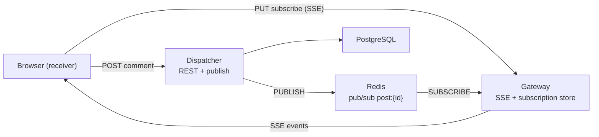

<!-- Generated by SpecStory, Markdown v2.1.0 -->

# 2026-05-19 14:31:14Z

<!-- Cursor IDE Session 21a6f636-6464-4d5e-b3c3-2fa5c429b3d6 (2026-05-19 14:31:14Z) -->

_**User**_

i am trying to have a presentation with this project, i am at the slide where i have to explain briefly the tech stack, the terminolofy of this project. you can abide by the article https://systemdesign.one/live-comment-system-design/  and give me a suggestion

---

_**Agent (composer-2.5)**_

I'll review your design doc and codebase so the tech stack and terminology slide matches what you've actually built.


_**Agent (composer-2.5)**_

<tool-use data-tool-type="read" data-tool-name="read_file_v2"><details>
<summary>Tool use: **read_file_v2**</summary>
File not found
</details></tool-use>

_**Agent (composer-2.5)**_

<tool-use data-tool-type="search" data-tool-name="glob_file_search"><details>
<summary>Tool use: **glob_file_search** • Searched codebase "" • **45** results in **1** directory</summary>

Directory: **`/home/duy-hieu/chat`** (45 files)

| File |
|------|
| `RWMutex_cheat_sheet.txt` |
| `internal/httputil/httputil.go` |
| `internal/models/refresh_token.go` |
| `.env.example` |
| `internal/logger/logger.go` |
| `internal/pubsub/redis_test.go` |
| `cursor_prompt (1).md` |
| `internal/auth/refresh.go` |
| `internal/repository/users.go` |
| `internal/middleware/middleware.go` |
| `internal/repository/refresh_tokens.go` |
| `internal/handlers/sse.go` |
| `go.sum` |
| `internal/auth/jwt.go` |
| `internal/sse/writer.go` |
| `docker-compose.yml` |
| `internal/pubsub/pubsub.go` |
| `cmd/dispatcher/main.go` |
| `.specstory/.project.json` |
| `internal/subscription/inmemorystore_test.go` |
| `migrations/000001_init_auth.up.sql` |
| `internal/services/auth.go` |
| `cmd/gateway/main.go` |
| `internal/subscription/inmemorystore.go` |
| `migrations/000001_init_auth.down.sql` |
| `internal/handlers/auth.go` |
| `internal/auth/password.go` |
| `internal/db/db.go` |
| `cmd/dispatcher/dispatcher` |
| `internal/pubsub/redis.go` |
| `.specstory/history/2026-04-21_04-23-22Z-review-of-cursor-prompt-documentation.md` |
| `internal/pubsub/factory.go` |
| `internal/pubsub/streams.go` |
| `go.mod` |
| `internal/models/user.go` |
| `internal/channels/channels.go` |
| `internal/config/config.go` |
| `.cursorindexingignore` |
| `.specstory/history/2026-05-18_02-51-46Z-jsonl-file-review.md` |
| `Makefile` |
| `.specstory/cli/config.toml` |
| `internal/redisclient/redisclient.go` |
| `.gitignore` |
| `.specstory/statistics.json` |
| `internal/feed/hub.go` |
</details></tool-use>

_**Agent (composer-2.5)**_

<tool-use data-tool-type="read" data-tool-name="read_file_v2"><details>
<summary>Tool use: **read_file_v2** • Read file: /home/duy-hieu/chat/go.mod</summary>

</details></tool-use>

_**Agent (composer-2.5)**_

<tool-use data-tool-type="unknown" data-tool-name="web_fetch"><details>
<summary>Tool use: **web_fetch**</summary>

Parameters:

```json
{
  "url": "https://systemdesign.one/live-comment-system-design/"
}
```
Additional data:

```json
{
  "reviewData": {
    "isShowingInput": false,
    "selectedOption": "run",
    "status": "Done"
  }
}
```
Result:

```json
{
  "markdown": "Live Comment System Design - System Design\n\n# Live Comment System Design\n\n## Real-Time Live Commenting Platform\n\n---\n\nThe target audience for this article falls into the following roles:\n\n- References\n- Tech workers\n- Students\n- Engineering managers\n\nThe prerequisite to reading this article is fundamental knowledge of system design components. This article does not cover an in-depth guide on individual system design components.\n\nDisclaimer: The system design questions are subjective. This article is written based on the research I have done on the topic and might differ from real-world implementations. Feel free to share your feedback and ask questions in the comments.\n\n---\n\n---\n\nDownload my system design playbook for free on newsletter signup:\n\n---\n\n## How Does the Live Comment Work?\n\nAt a high level, the Live Comment service performs the following operations:\n\n- gateway server fans out live comments to the clients through [server-sent events](https://developer.mozilla.org/en-US/docs/Web/API/Server-sent_events/Using_server-sent_events)(SSE)\n- the client subscribes to a live video on the gateway server over Hypertext Transfer Protocol (HTTP)\n- in-memory subscription store on the gateway server keeps the viewership associativity\n- gateway server subscribes to a live video on the endpoint store\n- endpoint store keeps the set of gateway servers subscribed to a particular live video\n- heartbeat signal or time to live (TTL) on keys on the subscription store can be used to drain the inactive SSE connections\n- ending of a live video can trigger an update on the endpoint store\n- dispatcher broadcasts the live comments to the dispatcher in peer data centers\n\n---\n\n---\n\n---\n\n## What is a Live Video?\n\nLive video is the streaming of video over the internet in real-time without prior recording and storage. Television broadcasts, video game streams, and social media videos are often live-streamed 1.\n\n[Figure 1: Fac
… (output truncated)
```
User decision: **accepted**

Status: **completed**

</details></tool-use>

_**Agent (composer-2.5)**_

<tool-use data-tool-type="read" data-tool-name="read_file_v2"><details>
<summary>Tool use: **read_file_v2** • Read file: /home/duy-hieu/chat/cmd/gateway/main.go</summary>

</details></tool-use>

_**Agent (composer-2.5)**_

<tool-use data-tool-type="read" data-tool-name="read_file_v2"><details>
<summary>Tool use: **read_file_v2** • Read file: /home/duy-hieu/chat/cmd/dispatcher/main.go</summary>

</details></tool-use>

_**Agent (composer-2.5)**_

<tool-use data-tool-type="read" data-tool-name="read_file_v2"><details>
<summary>Tool use: **read_file_v2** • Read file: /home/duy-hieu/chat/docker-compose.yml</summary>

</details></tool-use>

_**Agent (composer-2.5)**_

<tool-use data-tool-type="read" data-tool-name="read_file_v2"><details>
<summary>Tool use: **read_file_v2** • Read file: /home/duy-hieu/chat/internal/feed/hub.go</summary>

</details></tool-use>

_**Agent (composer-2.5)**_

<tool-use data-tool-type="read" data-tool-name="read_file_v2"><details>
<summary>Tool use: **read_file_v2** • Read file: /home/duy-hieu/chat/internal/handlers/sse.go</summary>

</details></tool-use>

_**Agent (composer-2.5)**_

<tool-use data-tool-type="read" data-tool-name="read_file_v2"><details>
<summary>Tool use: **read_file_v2** • Read file: /home/duy-hieu/chat/internal/subscription/inmemorystore.go</summary>

</details></tool-use>

_**Agent (composer-2.5)**_

<tool-use data-tool-type="read" data-tool-name="read_file_v2"><details>
<summary>Tool use: **read_file_v2** • Read file: /home/duy-hieu/chat/internal/pubsub/pubsub.go</summary>

</details></tool-use>

_**Agent (composer-2.5)**_

<tool-use data-tool-type="read" data-tool-name="read_file_v2"><details>
<summary>Tool use: **read_file_v2** • Read file: /home/duy-hieu/chat/internal/channels/channels.go</summary>

</details></tool-use>

_**Agent (composer-2.5)**_

<tool-use data-tool-type="read" data-tool-name="read_file_v2"><details>
<summary>Tool use: **read_file_v2** • Read file: /home/duy-hieu/chat/internal/config/config.go</summary>

</details></tool-use>

_**Agent (composer-2.5)**_

<tool-use data-tool-type="read" data-tool-name="read_file_v2"><details>
<summary>Tool use: **read_file_v2** • Read file: /home/duy-hieu/chat/cursor_prompt (1).md</summary>

</details></tool-use>

_**Agent (composer-2.5)**_

<tool-use data-tool-type="read" data-tool-name="read_file_v2"><details>
<summary>Tool use: **read_file_v2** • Read file: /home/duy-hieu/chat/internal/pubsub/redis.go</summary>

</details></tool-use>

_**Agent (composer-2.5)**_

<think><details><summary>Thought Process</summary>
I now have a comprehensive understanding.
</details></think>

_**Agent (composer-2.5)**_

<tool-use data-tool-type="unknown" data-tool-name="ripgrep_raw_search"><details>
<summary>Tool use: **ripgrep_raw_search**</summary>

Parameters:

```json
{
  "caseInsensitive": false,
  "glob": "*.go",
  "path": "/home/duy-hieu/chat",
  "pattern": "endpoint"
}
```
Additional data:

```json
{
  "isPruned": true,
  "outputMode": "content",
  "path": "/home/duy-hieu/chat",
  "pattern": "endpoint",
  "topFiles": [
    {
      "matchCount": 1,
      "uri": "./internal/handlers/auth.go"
    },
    {
      "matchCount": 1,
      "uri": "./internal/config/config.go"
    }
  ],
  "totalFiles": 2,
  "totalMatches": 2
}
```
Status: **completed**

</details></tool-use>

_**Agent (composer-2.5)**_

<tool-use data-tool-type="read" data-tool-name="read_file_v2"><details>
<summary>Tool use: **read_file_v2** • Read file: /home/duy-hieu/chat/cursor_prompt (1).md</summary>

</details></tool-use>

_**Agent (composer-2.5)**_

<think><details><summary>Thought Process</summary>
The store endpoint is defined in the design specification but remains unimplemented in the codebase.
</details></think>

_**Agent (composer-2.5)**_

Here is a concise slide you can use, aligned with [Neo Kim’s live comment system design](https://systemdesign.one/live-comment-system-design/) and mapped to **your** repo.

---

## Suggested slide title

**Tech stack & terminology — real-time social feed**

---

## One-liner (opening sentence)

> We follow the **gateway + dispatcher** real-time platform from the live-comment design: clients subscribe over **SSE**, events are **published** through a **pub/sub bus**, and each gateway **fans out** only to browsers watching that resource.

---

## Tech stack (left column on slide)

| Layer | Choice | Role in this project |
|--------|--------|----------------------|
| **Language** | Go 1.25 | Two binaries: `gateway`, `dispatcher` |
| **HTTP** | chi router | REST auth + SSE endpoints |
| **Real-time (feed)** | SSE (`text/event-stream`) | Push comments/reactions to open post views |
| **Real-time (chat, planned)** | WebSocket | Messenger-style chat + presence |
| **Message bus** | Redis pub/sub (`go-redis`) | `PUBLISH` / `SUBSCRIBE` on channels like `post:{id}` |
| **Database** | PostgreSQL (`pgx`) | Users, posts, comments, messages |
| **Cache / ephemeral state** | Redis | Pub/sub now; presence + endpoint store planned |
| **Object storage** | MinIO (S3-compatible) | Images/videos for posts |
| **Auth** | JWT + refresh tokens | Protect subscribe/publish APIs |
| **Local infra** | Docker Compose | Postgres, Redis, MinIO |

**Optional footnote for Q&A:** The article’s full production design also uses an **endpoint store** (which gateways care about which post). Your spec defines that in Redis; the current code uses **Redis channels + in-memory subscription store + `feed.Hub`** as the working slice (M9).

---

## Terminology (right column — article → your project)

Use the article’s vocabulary, then map it in one breath:

| Article term | In your project |
|--------------|-----------------|
| **Live video** | **Post** (home feed item users open and watch) |
| **Live comment** | **Comment / reaction / like** on a post |
| **Publisher** | Client (or API) that **writes** a comment via HTTP POST |
| **Receiver** | Client with an open **SSE** stream watching that post |
| **Gateway server** | `cmd/gateway` — holds long-lived SSE connections, delivers events |
| **Dispatcher** | `cmd/dispatcher` — receives writes, **routes** events to the right place |
| **Subscription store** | In-memory map on each gateway: *post → browser connections* (`internal/subscription`) |
| **Endpoint store** | Shared Redis set: *post → gateway IDs* (design spec; routing layer for dispatcher) |
| **Pub/sub server** | Redis channel `post:{postID}` (`internal/channels`, `internal/pubsub`) |
| **Event-driven API** | REST for writes; **SSE** for push delivery (article’s recommended model) |
| **Fan-out** | One published event → many SSE clients on that gateway |
| **Subscribe workflow** | `PUT /sse/posts/{postID}/subscriptions` with `Accept: text/event-stream` |
| **Publish workflow** | POST comment → dispatcher persists → publish to Redis → gateway → SSE |

**Domain rename for your app:** The article says “live video”; you say **post**. Same pattern, different resource ID.

---

## Minimal architecture diagram (for the slide)



This mirrors the article’s Figure 17 flow, simplified for a single-datacenter prototype.

---

## Bullet script (30–45 seconds spoken)

You could say:

1. **Stack:** Go backend, Postgres for durable data, Redis for real-time messaging, MinIO for media, JWT for auth.
2. **Pattern:** Inspired by Facebook-style live comments — we split **connection handling** (gateway) from **event routing** (dispatcher).
3. **Transport:** Home feed uses **SSE**, not WebSockets, because receivers only need a one-way stream while viewing a post — same reasoning as the article.
4. **Terms:** A **receiver** subscribes to a **post**; a **publisher** posts a comment; the **subscription store** tracks which browsers on this gateway care; **Redis pub/sub** carries events between dispatcher and gateways.
5. **Next:** Chat will add **WebSockets** and **presence** — a second domain, same platform idea.

---

## What to emphasize vs. what to defer

**Say on this slide:**
- Why SSE for the feed (HTTP, one-way, scales with many viewers)
- Gateway vs dispatcher responsibilities
- Subscription store vs pub/sub channel

**Save for a later slide (or one honest line):**
- Endpoint store and multi-gateway HTTP forwarding (article’s scaled design; in your spec, partially ahead of current code)
- Redis Streams as an alternative backend (`PubSubStreams` stub exists)
- Cross–data center broadcasting (article section you intentionally skip for single-DC)

---

## Optional “terminology” mini-box (article CAP / NFR words)

If the audience expects system-design vocabulary from the article, add three terms only:

- **Read-heavy** — many viewers, few writers (comments on a popular post)
- **Low latency** — target &lt; 250 ms perceived “live”
- **Horizontal scaling** — add more gateway instances; dispatcher + endpoint store route to the right one

---

## Slide layout suggestion

```
┌─────────────────────────────────────────────────────────┐
│  Tech stack & terminology                               │
├──────────────────────┬──────────────────────────────────┤
│  TECH STACK          │  KEY TERMS (article → us)        │
│  • Go (gateway,      │  Live video  → Post              │
│    dispatcher)       │  Receiver    → SSE subscriber    │
│  • SSE (feed)        │  Gateway     → connection +      │
│  • WebSocket (chat)  │                local fan-out     │
│  • PostgreSQL        │  Dispatcher  → publish + route   │
│  • Redis pub/sub     │  Subscription store → per-gateway│
│  • MinIO + JWT       │                browser map       │
│                      │  Pub/sub     → post:{id} channel │
├──────────────────────┴──────────────────────────────────┤
│  [diagram: Browser ↔ Gateway ↔ Redis ↔ Dispatcher ↔ DB] │
└─────────────────────────────────────────────────────────┘
```

---

If you want, I can draft the **next slide** (subscribe/publish sequence with your exact endpoints and file names) or a **speaker note** version that references `feed.Hub` and `PUT /sse/posts/{postID}/subscriptions` line-by-line.

---

_**User**_

that is too  much into the architecture, i am on the introduction slide actually.
try shorten this information, it might be the one:
What is a Live Video?
Live video is the streaming of video over the internet in real-time without prior recording and storage. Television broadcasts, video game streams, and social media videos are often live-streamed 1.

Figure 1: Facebook Likes; Typing indicators; Live commentsFigure 1: Facebook Likes; Typing indicators; Live comments
Live video is different from regular videos because live video results in spiky traffic patterns. Usually, Live videos are more engaging and tend to be watched thrice more than regular videos. On top of that, social networks such as Facebook show live videos at the top of the newsfeed, thereby increasing the probability of live videos being watched by the users (clients) 2.

What are Live Comments?


Live comments; Source: video by Joseph Redfield Nino from Pixabay
Real-time experience makes the platform feel like a place of activity for the clients 3. Live commenting is a feature that allows clients to publish real-time comments on live videos. The live comments are usually a mixture of feedback from the clients on the live video or casual conversations between clients. Besides, live comments enable the streamer of the live video to engage with the clients during the live video broadcast.

btw, the language is vietnamese

---

_**Agent (composer-2.5)**_

<think><details><summary>Thought Process</summary>
Ngi dng mun ni dung slide gii thiu ngn gn bng ting Vit.
</details></think>

_**Agent (composer-2.5)**_

**Slide giới thiệu — ngắn gọn (tiếng Việt)**

---

## Tiêu đề gợi ý
**Live video & bình luận trực tiếp — bài toán thời gian thực**

---

## Live video là gì?

**Live video** là phát video qua internet **theo thời gian thực**, không cần ghi hình và lưu trước. Ví dụ: phát sóng truyền hình, stream game, video trực tiếp trên mạng xã hội.

Khác với video thường, live video có **lưu lượng tăng đột biến** — nhiều người xem cùng lúc, tương tác dồn dập trong thời gian ngắn.

---

## Bình luận trực tiếp (Live comments) là gì?

**Live comments** cho phép người xem **gửi và nhận bình luận ngay lập tức** trong khi video đang phát.

- Tạo cảm giác **sôi động, có người đang tham gia**
- Người xem phản hồi nhanh, trò chuyện với nhau
- Người stream **tương tác trực tiếp** với khán giả

*Hình minh họa:* like, typing indicator, bình luận trực tiếp (Facebook Live).

---

## Câu chuyển sang dự án của bạn (1 dòng cuối slide)

> Dự án này áp dụng mô hình tương tự cho **mạng xã hội**: người dùng xem **bài viết** và nhận **bình luận, reaction** theo thời gian thực — không cần tải lại trang.

---

## Script nói (~30 giây)

*"Live video là video phát trực tiếp, không lưu trước. Nó thu hút nhiều người xem cùng lúc nên traffic rất spiky. Live comments là tính năng cho phép khán giả bình luận và thấy phản hồi ngay — giống Facebook Live. Dự án của em/chúng em xây nền tảng real-time kiểu đó, nhưng cho feed bài viết: comment và reaction hiện ngay khi có người tương tác."*

---

Nếu slide chỉ được **3–4 bullet**, dùng bản rút gọn này:

- **Live video:** phát video thời gian thực → traffic tăng đột biến  
- **Live comments:** bình luận hiện ngay → tăng tương tác  
- **Mục tiêu dự án:** mang trải nghiệm real-time đó vào **feed bài viết** (comment, reaction)

Muốn giữ đúng ngữ cảnh bài viết gốc (Facebook Live) hay nhấn mạnh **post/feed** ngay từ slide đầu?

---

_**User**_

can you distill this paragaph to fit in one slide ?
The Redis stream is a data structure that can be used like an append-only log for improving the responsiveness of the system. In simple words, Redis streams are functionally very equivalent to Apache Kafka. The Redis streams as the pub-sub server offer the following benefits 17, 18, 5, 19, 20, 21:

guaranteed at least one-time delivery of messages
reliable messages through persistence with Append Only File (AOF) or Redis Database (RDB) persistency methods
more tolerant to network partitions
improved latency due to efficient in-memory storage
relatively trivial to provision and operate
messages can be consumed either in blocking or non-blocking methods
The Redis Sentinel or Redis Active-Active configuration provides high availability for the cluster at the expense of increased operational complexity. The Redis Sentinel is a distributed system that monitors and provides failover policies to Redis instances. Redis streams could dynamically unsubscribe consumers from a specific topic (live video). However, there is a risk of data loss in Redis streams because the data is only periodically written to disk. The memory limitation could also be a bottleneck to building a scalable live commenting service 19, 21. In conclusion, do not use Redis streams as the pub-sub server solution for implementing live comments.

---

_**Agent (composer-2.5)**_

<think><details><summary>Thought Process</summary>
The user wants me to summarize a paragraph about Redis Streams from a system design article into concise slide-ready content.
</details></think>

_**Agent (composer-2.5)**_

Here is a **one-slide** version:

---

## Redis Streams — Pub/Sub cho Live Comments?

**Redis Streams** = cấu trúc dữ liệu dạng **append-only log** (tương đương **Apache Kafka** ở mức cơ bản).

**Ưu điểm**
- Giao hàng **ít nhất một lần** (at-least-once)
- **Bền** nhờ persistence (AOF / RDB)
- Chịu **network partition** tốt hơn pub/sub thuần
- **Độ trễ thấp** (in-memory)
- Dễ triển khai; consume **blocking** hoặc **non-blocking**
- HA qua **Redis Sentinel** / **Active-Active** (đổi lại phức tạp vận hành)

**Hạn chế**
- Dữ liệu ghi disk **theo chu kỳ** → rủi ro **mất message**
- **Giới hạn RAM** → khó scale live comments quy mô lớn
- Unsubscribe động theo topic vẫn khả thi, nhưng chưa đủ tin cậy cho use case này

**Kết luận (bài viết):** ❌ **Không dùng Redis Streams** làm pub-sub server cho live comments.

---

**Speaker note (1 câu):** *Streams mạnh cho log/message queue, nhưng live comments cần routing linh hoạt + scale lớn — kiến trúc cuối của bài chọn subscription store + endpoint store thay vì Streams.*

---

_**User**_

why our design go with redis pubsub? 

---

_**Agent (composer-2.5)**_

<think><details><summary>Thought Process</summary>
The user wants to understand the rationale behind selecting Redis pub/sub for their project design.

Redis pub/sub was chosen as the default implementation for the PubSub interface due to its simplicity and suitability for single datacenter deployments, even though system design articles often advise against it for high-scale live comment systems.
</details></think>

_**Agent (composer-2.5)**_

Checking the project spec for the stated rationale behind choosing Redis pub/sub.


_**Agent (composer-2.5)**_

<tool-use data-tool-type="read" data-tool-name="read_file_v2"><details>
<summary>Tool use: **read_file_v2** • Read file: /home/duy-hieu/chat/cursor_prompt (1).md</summary>

</details></tool-use>

_**Agent (composer-2.5)**_

<tool-use data-tool-type="read" data-tool-name="read_file_v2"><details>
<summary>Tool use: **read_file_v2** • Read file: /home/duy-hieu/chat/internal/pubsub/factory.go</summary>

</details></tool-use>

_**Agent (composer-2.5)**_

<tool-use data-tool-type="read" data-tool-name="read_file_v2"><details>
<summary>Tool use: **read_file_v2** • Read file: /home/duy-hieu/chat/cursor_prompt (1).md</summary>

</details></tool-use>

_**Agent (composer-2.5)**_

<tool-use data-tool-type="unknown" data-tool-name="ripgrep_raw_search"><details>
<summary>Tool use: **ripgrep_raw_search**</summary>

Parameters:

```json
{
  "caseInsensitive": true,
  "path": "/home/duy-hieu/chat/cursor_prompt (1).md",
  "pattern": "Kafka|pub.?sub|single"
}
```
Additional data:

```json
{
  "isPruned": true,
  "outputMode": "content",
  "path": "/home/duy-hieu/chat/cursor_prompt (1).md",
  "pattern": "Kafka|pub.?sub|single",
  "topFiles": [
    {
      "matchCount": 16,
      "uri": "cursor_prompt (1).md"
    }
  ],
  "totalFiles": 1,
  "totalMatches": 16
}
```
Status: **completed**

</details></tool-use>

_**Agent (composer-2.5)**_

<tool-use data-tool-type="read" data-tool-name="read_file_v2"><details>
<summary>Tool use: **read_file_v2** • Read file: /home/duy-hieu/chat/cursor_prompt (1).md</summary>

</details></tool-use>

_**Agent (composer-2.5)**_

<think><details><summary>Thought Process</summary>
I now have a clear understanding and will explain why Redis pub/sub aligns with their design.

Redis pub/sub fits well because the project is scoped to a single datacenter without Kafka, and Redis is already part of the infrastructure used for presence, endpoint storage, and comment caching. This approach works for their scale since real-time, fire-and-forget events are handled with PostgreSQL ensuring durability, and Redis provides low-latency, in-memory messaging suitable for live comments.
</details></think>

_**Agent (composer-2.5)**_

Short answer: **Redis pub/sub is the message bus between dispatcher and gateway**, not the whole system. Durability lives in **PostgreSQL**; client delivery lives in the **in-memory subscription store**. Pub/sub is chosen because it fits your **single-datacenter, low-ops** scope and the **ephemeral, channel-based** subscribe/unsubscribe pattern.

---

## What Redis pub/sub does in *your* design

It is **not** the only way comments reach users. The flow is:

1. Comment is **saved to PostgreSQL** (source of truth).
2. Dispatcher **PUBLISH**es to channel `post:{id}`.
3. Gateway **SUBSCRIBE**s only while at least one browser on that gateway is watching (`feed.Hub` refcount).
4. Gateway **fans out** to SSE clients via the in-memory subscription store.

So pub/sub carries **“something new happened on this post”** — fast and fire-and-forget. If a message is missed, the client can still load history from Postgres/cache.

That is different from the article’s warning: they reject Redis pub/sub when it is the **only** delivery path at Facebook scale, with no durable write path and no local fan-out layer.

---

## Why this project picks pub/sub (not Kafka / Streams)

| Reason | Explanation |
|--------|-------------|
| **Scope** | Single datacenter, no Kafka/Cassandra — explicit in your project spec. |
| **Redis already there** | Same Redis for pub/sub, presence, endpoint store, comment cache → one service in Docker Compose. |
| **Low latency** | In-memory broadcast; good for “live” feel (&lt; 250 ms). |
| **Dynamic subscribe/unsubscribe** | User scrolls away → gateway **UNSUBSCRIBE**s. Kafka-style topics make this expensive; the article rejects Kafka partly for that. |
| **Channel = resource** | `post:{id}` maps cleanly to “events for this post” — matches live-comment routing. |
| **Simplicity** | `PUBLISH` / `SUBSCRIBE` is easy to run and debug for a student/prototype project. |
| **Swappable** | Hidden behind `PubSub` interface; Streams is a future one-line swap if you need stronger delivery semantics. |

---

## Why not the alternatives (for *your* context)

**Kafka** — Overkill for single-DC; higher ops cost; pull-based consumers; hard to unsubscribe from many topics as users scroll the feed (article’s main Kafka objection).

**Redis Streams** — Stronger delivery guarantees, but heavier, memory-bound, and the article still concludes it is **not** the right pub-sub core for massive live comments. Your spec keeps Streams as an optional backend, not the default.

**HTTP-only between dispatcher ↔ gateway** — Works for routing (and your full spec uses endpoint store + HTTP forward), but you still need a **bus** so gateways learn about new events without the dispatcher calling every gateway on every write. Pub/sub fills that gap.

---

## Tradeoffs you accept (good to say in Q&A)

Redis pub/sub is **not** at-least-once delivery:

- If no subscriber is connected, the message is **dropped** on the bus.
- That is OK here because **Postgres already persisted** the comment.
- Real-time path is **best-effort push**; history is **pull** from DB/cache.

At huge scale (many Redis nodes, cross-DC), the article prefers **endpoint store + gateway fan-out**, not raw Redis pub/sub alone. Your design follows that pattern conceptually; pub/sub is just the **internal event wire** inside one datacenter.

---

## One slide / one sentence (tiếng Việt)

> **Chúng em dùng Redis pub/sub vì nó nhẹ, nhanh, dễ vận hành trong single-DC, và phù hợp subscribe/unsubscribe theo từng post. Comment vẫn được lưu Postgres; pub/sub chỉ đẩy sự kiện real-time từ dispatcher tới gateway — gateway mới fan-out tới browser qua SSE.**

If you want, I can turn this into a **“Why Redis Pub/Sub?”** slide with 4 bullets in Vietnamese only.
